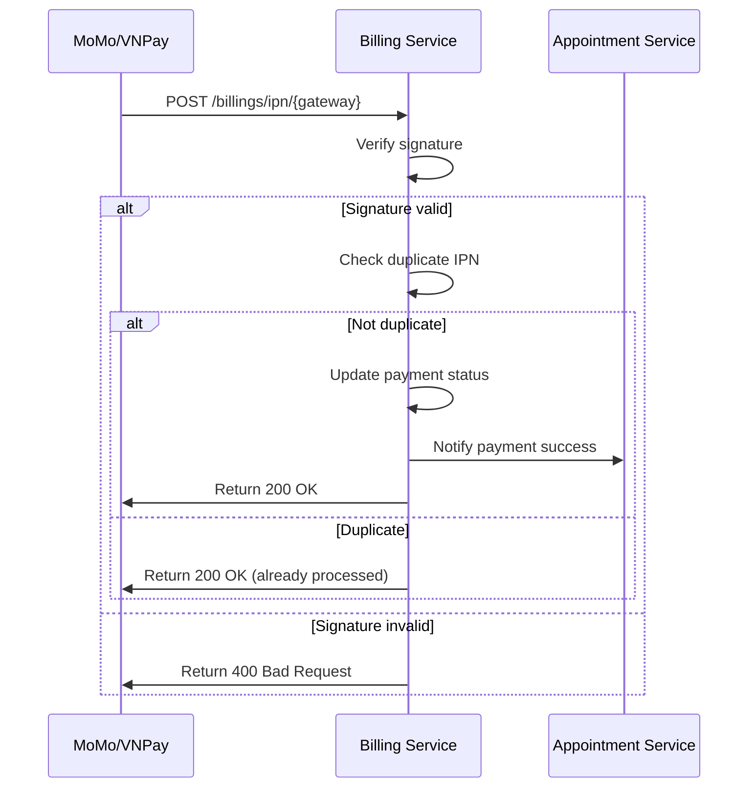

# 💳 Billing Service - Smart Health System

Dịch vụ quản lý thanh toán cho hệ thống Smart Health, hỗ trợ nhiều cổng thanh toán (MoMo, VNPay) và thanh toán tiền mặt.

---

## 📋 Mục lục

- [Tính năng](#-tính-năng)
- [Công nghệ](#-công-nghệ)
- [Cài đặt](#-cài-đặt)
- [Cấu hình](#-cấu-hình)
- [API Documentation](#-api-documentation)
- [Payment Flow](#-payment-flow)
- [Testing](#-testing)
- [Troubleshooting](#-troubleshooting)

---

## ✨ Tính năng

### Core Features
- ✅ **Thanh toán qua MoMo**: Tích hợp ví điện tử MoMo
- ✅ **Thanh toán qua VNPay**: Tích hợp cổng thanh toán VNPay
- ✅ **Thanh toán tiền mặt**: Cho lễ tân tại quầy
- ✅ **IPN Handler**: Xử lý callback từ payment gateways
- ✅ **Multiple Payment Types**: APPOINTMENT_FEE, LAB_TEST, OTHER
- ✅ **Payment Expiration**: Auto expire sau 15 phút
- ✅ **Idempotency**: Tránh xử lý IPN trùng lặp

### Admin Features
- ✅ **Revenue Statistics**: Thống kê doanh thu theo khoảng thời gian
- ✅ **Payment Method Stats**: Phân tích theo phương thức thanh toán
- ✅ **Revenue Trends**: Xu hướng doanh thu (daily, weekly, monthly)
- ✅ **Distribution Reports**: Báo cáo phân bổ theo bác sĩ/khoa

---

## 🛠 Công nghệ

- **Java**: 17+
- **Spring Boot**: 3.x
- **Spring Data JPA**: Database access
- **PostgreSQL**: Database
- **Spring Cloud OpenFeign**: Service communication
- **Lombok**: Reduce boilerplate
- **Springdoc OpenAPI**: API documentation

---

## 📦 Cài đặt

### 1. Prerequisites

```bash
# Java 17 hoặc cao hơn
java -version

# PostgreSQL
psql --version

# Maven hoặc Gradle
mvn -version
```

### 2. Clone & Build

```bash
# Clone repository
git clone <repository-url>
cd smart-health-backend/billing

# Build với Gradle
./gradlew clean build

# Hoặc với Maven
mvn clean install
```

### 3. Database Setup

```sql
-- Tạo database
CREATE DATABASE billing_db;

-- Tạo user (optional)
CREATE USER billing_user WITH PASSWORD 'your_password';
GRANT ALL PRIVILEGES ON DATABASE billing_db TO billing_user;
```

### 4. Run Application

```bash
# Development mode
./gradlew bootRun

# Production
java -jar build/libs/billing-service.jar
```

Server sẽ chạy tại: `http://localhost:8083`

---

## ⚙️ Cấu hình

### Environment Variables

Tạo file `.env` hoặc set biến môi trường:

```bash
# Database
DB_URL=jdbc:postgresql://localhost:5432/billing_db
DB_USERNAME=postgres
DB_PASSWORD=your_password

# Server
SERVER_PORT=8083

# Frontend
FRONTEND_URL=http://localhost:3000

# MoMo Configuration
MOMO_PARTNER_CODE=your_partner_code
MOMO_ACCESS_KEY=your_access_key
MOMO_SECRET_KEY=your_secret_key
MOMO_API_ENDPOINT=https://test-payment.momo.vn/v2/gateway/api/create
MOMO_RETURN_URL=http://localhost:8083/api/v1/billings/return
MOMO_IPN_URL=http://localhost:8083/api/v1/billings/ipn/momo

# VNPay Configuration
VNPAY_TMN_CODE=your_tmn_code
VNPAY_SECRET_KEY=your_secret_key
VNPAY_PAY_URL=https://sandbox.vnpayment.vn/paymentv2/vpcpay.html
VNPAY_RETURN_URL=http://localhost:8083/api/v1/billings/return

# Eureka (nếu dùng microservices)
EUREKA_ENABLED=true
EUREKA_SERVER=http://localhost:8761/eureka/
```

### MoMo Test Credentials

Để test MoMo, sử dụng credentials sau (từ MoMo Developer):

```yaml
momo:
  partner-code: MOMOBKUN20180529
  access-key: klm05TvNBzhg7h7j
  secret-key: at67qH6mk8w5Y1nAyMoYKMWACiEi2bsa
```

**Lưu ý**: Đây là test credentials, KHÔNG dùng trong production!

### VNPay Test Setup

1. Đăng ký tài khoản test tại: https://sandbox.vnpayment.vn/
2. Lấy `TMN_CODE` và `SECRET_KEY` từ portal
3. Cấu hình vào `application.yml`

---

## 📚 API Documentation

### Swagger UI

Truy cập Swagger UI tại: `http://localhost:8083/swagger-ui.html`

### Main Endpoints

#### 1. Create Payment Request

```http
POST /api/v1/billings
Content-Type: application/json

{
  "paymentType": "APPOINTMENT_FEE",
  "referenceId": "APT-12345",
  "amount": 200000,
  "paymentMethod": "MOMO"
}
```

**Response:**
```json
{
  "id": 1,
  "paymentCode": "uuid-here",
  "paymentType": "APPOINTMENT_FEE",
  "referenceId": "APT-12345",
  "amount": 200000,
  "status": "PROCESSING",
  "paymentMethod": "MOMO",
  "paymentUrl": "https://test-payment.momo.vn/...",
  "createdAt": "2025-01-20T10:30:00",
  "expiredAt": "2025-01-20T10:45:00"
}
```

#### 2. Create Cash Payment

```http
POST /api/v1/billings/cash-payment
Content-Type: application/json
X-User-Id: RECEPTIONIST_ID

{
  "referenceId": "APT-12345",
  "amount": 200000,
  "paymentType": "APPOINTMENT_FEE",
  "notes": "Thanh toán tại quầy"
}
```

#### 3. Search Payments

```http
GET /api/v1/billings/search?startDate=2025-01-01&endDate=2025-01-31&status=COMPLETED&page=0&size=20
```

#### 4. Get Today's Payments

```http
GET /api/v1/billings/today?status=COMPLETED
```

#### 5. Get Payment by Appointment

```http
GET /api/v1/billings/by-appointment/{appointmentId}
```

### Admin Endpoints

```http
# Revenue statistics
GET /api/v1/admin/billings/revenue-stats?startDate=2025-01-01&endDate=2025-01-31

# Payment method statistics
GET /api/v1/admin/billings/payment-method-stats?startDate=2025-01-01&endDate=2025-01-31

# Revenue trends
GET /api/v1/admin/billings/revenue-trends?period=DAILY&startDate=2025-01-01&endDate=2025-01-31

# Revenue distribution
GET /api/v1/admin/billings/revenue-distribution?groupBy=DOCTOR&startDate=2025-01-01&endDate=2025-01-31
```

---

## 🔄 Payment Flow

### User Payment Flow (MoMo/VNPay)

```
1. User chọn appointment và nhấn "Thanh toán"
   ↓
2. Frontend gọi: POST /billings
   ↓
3. Backend tạo Payment entity (status: PENDING)
   ↓
4. Backend gọi MoMo/VNPay API để tạo payment URL
   ↓
5. Backend lưu payment (status: PROCESSING)
   ↓
6. Backend trả về paymentUrl cho frontend
   ↓
7. Frontend redirect user đến paymentUrl
   ↓
8. User thanh toán trên MoMo/VNPay
   ↓
9. MoMo/VNPay gửi IPN callback đến backend
   ↓
10. Backend verify signature và update payment status
    ↓
11. Backend notify Appointment Service (nếu cần)
    ↓
12. MoMo/VNPay redirect user về /payment/success
```

### Cash Payment Flow

```
1. Receptionist chọn appointment cần thanh toán
   ↓
2. Frontend gọi: POST /billings/cash-payment
   ↓
3. Backend tạo Payment entity (status: COMPLETED)
   ↓
4. Backend notify Appointment Service
   ↓
5. Backend trả về payment info
   ↓
6. Frontend hiển thị thông báo thành công
```

### IPN Processing



---

## 🧪 Testing

### Unit Tests

```bash
# Run all tests
./gradlew test

# Run specific test class
./gradlew test --tests BillingServiceImplTest

# With coverage
./gradlew test jacocoTestReport
```

### Integration Tests

```bash
# Với database test container
./gradlew integrationTest
```

### Manual Testing

#### Test MoMo Payment

```bash
curl -X POST http://localhost:8083/api/v1/billings \
  -H "Content-Type: application/json" \
  -d '{
    "paymentType": "APPOINTMENT_FEE",
    "referenceId": "TEST-APT-001",
    "amount": 100000,
    "paymentMethod": "MOMO"
  }'
```

Copy `paymentUrl` từ response và mở trong browser để test.

#### Test Cash Payment

```bash
curl -X POST http://localhost:8083/api/v1/billings/cash-payment \
  -H "Content-Type: application/json" \
  -H "X-User-Id: RECEPTIONIST_001" \
  -d '{
    "referenceId": "TEST-APT-001",
    "amount": 100000,
    "paymentType": "APPOINTMENT_FEE",
    "notes": "Test cash payment"
  }'
```

---

## 🐛 Troubleshooting

### Issue 1: MoMo Payment URL không hoạt động

**Symptoms:**
- PaymentUrl được tạo nhưng MoMo báo lỗi "Invalid signature"

**Solution:**
```bash
# Kiểm tra credentials
echo $MOMO_PARTNER_CODE
echo $MOMO_ACCESS_KEY
echo $MOMO_SECRET_KEY

# Kiểm tra logs
tail -f logs/billing-service.log | grep "MoMo"

# Verify signature generation
# Xem MomoPaymentGatewayService.java line ~100
```

### Issue 2: VNPay redirect sai URL

**Symptoms:**
- VNPay redirect về 404

**Solution:**
```yaml
# Kiểm tra VNPAY_RETURN_URL trong application.yml
vnpay:
  return-url: http://localhost:8083/api/v1/billings/return  # ✅ ĐÚNG
  # return-url: http://localhost:3000/payment/success       # ❌ SAI
```

### Issue 3: IPN không được xử lý

**Symptoms:**
- Payment vẫn PENDING sau khi thanh toán

**Possible Causes:**
1. IPN URL không accessible từ internet
2. Signature verification failed
3. Payment code không tìm thấy

**Solution:**
```bash
# 1. Test IPN endpoint locally
curl -X POST http://localhost:8083/api/v1/billings/ipn/momo \
  -H "Content-Type: application/json" \
  -d '{...}'

# 2. Check logs
grep "IPN" logs/billing-service.log

# 3. Use ngrok for local testing
ngrok http 8083
# Update MOMO_IPN_URL to ngrok URL
```

### Issue 4: Database connection error

**Symptoms:**
```
org.postgresql.util.PSQLException: Connection refused
```

**Solution:**
```bash
# Kiểm tra PostgreSQL đang chạy
pg_ctl status

# Kiểm tra credentials
psql -U postgres -d billing_db

# Update application.yml
spring:
  datasource:
    url: jdbc:postgresql://localhost:5432/billing_db
    username: postgres
    password: your_actual_password
```

### Issue 5: Duplicate IPN processing

**Symptoms:**
- Logs hiển thị "IPN already processed"

**Solution:**
- Đây là hành vi bình thường! Service đang hoạt động đúng.
- IPN idempotency đang prevent duplicate processing.

---

## 📝 Database Schema

### Payment Table

```sql
CREATE TABLE payments (
    id BIGSERIAL PRIMARY KEY,
    payment_code VARCHAR(255) UNIQUE NOT NULL,
    payment_type VARCHAR(50) NOT NULL,
    reference_id VARCHAR(255) NOT NULL,
    prescription_id VARCHAR(255),  -- Deprecated
    amount DECIMAL(19, 2) NOT NULL,
    status VARCHAR(50) NOT NULL,
    payment_method VARCHAR(50) NOT NULL,
    payment_url VARCHAR(1024),
    transaction_id VARCHAR(255),
    description VARCHAR(500),
    created_at TIMESTAMP NOT NULL,
    updated_at TIMESTAMP,
    expired_at TIMESTAMP,
    paid_at TIMESTAMP
);

-- Indexes
CREATE INDEX idx_payment_code ON payments(payment_code);
CREATE INDEX idx_reference_id ON payments(reference_id);
CREATE INDEX idx_status_created_at ON payments(status, created_at);
CREATE INDEX idx_reference_type ON payments(reference_id, payment_type);
```

---

## 🔒 Security Considerations

### 1. Signature Verification

```java
// Luôn verify signature từ payment gateway
String generatedHash = hmacSHA512(secretKey, canonicalString);
if (!Objects.equals(generatedHash, receivedHash)) {
    throw new RuntimeException("Invalid signature");
}
```

### 2. Idempotency

```java
// Check duplicate IPN
if (payment.getStatus() == PaymentStatus.COMPLETED) {
    log.warn("IPN already processed");
    return; // Bỏ qua
}
```

### 3. Amount Tampering Prevention

```java
// Backend PHẢI tự tính amount, không tin từ client
BigDecimal actualAmount = appointmentService.getConsultationFee(appointmentId);
payment.setAmount(actualAmount);
```

### 4. Environment Variables

```bash
# KHÔNG hardcode credentials!
# ✅ ĐÚNG
secret-key: ${MOMO_SECRET_KEY}

# ❌ SAI
secret-key: at67qH6mk8w5Y1nAyMoYKMWACiEi2bsa
```

---

## 📊 Monitoring & Logging

### Log Levels

```yaml
logging:
  level:
    fit.iuh.billing: DEBUG          # Billing service logs
    org.springframework.web: INFO   # Spring web logs
```

### Important Log Events

```
✅ Payment created: Payment {} created with status PENDING
✅ IPN received: Processing IPN for gateway {}, payment code {}
✅ Payment completed: Payment {} COMPLETED via IPN
⚠️  IPN duplicate: IPN already processed for payment code {}
❌ Invalid signature: Invalid IPN signature for payment code {}
```

---

## 🚀 Deployment

### Docker

```dockerfile
# Dockerfile
FROM openjdk:17-jdk-slim
WORKDIR /app
COPY build/libs/billing-service.jar app.jar
EXPOSE 8083
ENTRYPOINT ["java", "-jar", "app.jar"]
```

```bash
# Build & Run
docker build -t billing-service .
docker run -p 8083:8083 \
  -e DB_URL=jdbc:postgresql://db:5432/billing_db \
  -e MOMO_PARTNER_CODE=... \
  billing-service
```

### Docker Compose

```yaml
version: '3.8'
services:
  billing-service:
    build: .
    ports:
      - "8083:8083"
    environment:
      - DB_URL=jdbc:postgresql://postgres:5432/billing_db
      - DB_USERNAME=postgres
      - DB_PASSWORD=postgres
    depends_on:
      - postgres
```

---

## 🤝 Contributing

1. Fork repository
2. Create feature branch: `git checkout -b feature/amazing-feature`
3. Commit changes: `git commit -m 'Add amazing feature'`
4. Push to branch: `git push origin feature/amazing-feature`
5. Open Pull Request

---

## 📄 License

Copyright © 2025 Smart Health System. All rights reserved.

---

## 📞 Support

- **Email**: support@smarthealth.com
- **Documentation**: https://docs.smarthealth.com/billing
- **Issues**: https://github.com/smart-health/issues

---

## 🎯 Roadmap

- [ ] Refund functionality
- [ ] Recurring payments
- [ ] Invoice PDF generation
- [ ] Email notifications
- [ ] SMS notifications
- [ ] Payment analytics dashboard
- [ ] Multi-currency support
- [ ] Split payments
- [ ] Installment payments

---

**Last Updated**: 2025-01-20  
**Version**: 1.0.0  
**Status**: ✅ Production Ready