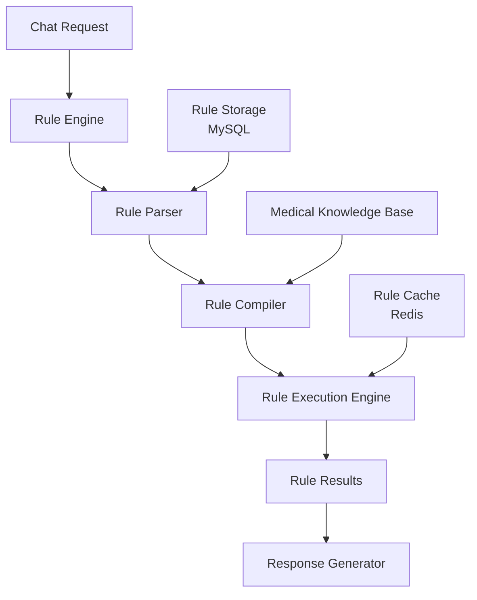

# Day 1: Rule Engine Architecture & Design

## 🎯 Mục tiêu ngày 1
Thiết kế kiến trúc Rule Engine hoàn chỉnh, định nghĩa rule schema, và chuẩn bị infrastructure cho implementation.

## 📋 Prerequisites
- Đã hoàn thành Week 1: Core chat service đang running
- MySQL và Redis services available
- Environment variables configured
- Understanding của medical emergency scenarios

## 🛠️ Tasks chi tiết

### 1. Thiết kế Rule Engine Architecture


### 2. Định nghĩa Rule Schema
```javascript
// Rule Definition Schema
{
  id: UUID,
  name: String,
  description: String,
  priority: Number, // 1-10, 10 highest
  conditions: [{
    field: String,   // e.g., "message.text"
    operator: String, // "contains", "equals", "matches"
    value: Any
  }],
  actions: [{
    type: String,    // "response", "redirect", "alert"
    payload: Object
  }],
  language: String,  // "vi", "en", etc.
  enabled: Boolean,
  createdAt: Date,
  updatedAt: Date
}
```

### 3. Tạo project structure cho Rule Engine
```bash
# Tạo rule engine structure
mkdir -p src/rule-engine/{parser,compiler,engine,storage}
mkdir -p tests/rule-engine
mkdir -p docs/rules

# Khởi tạo rule engine package
cd src/rule-engine
npm init -y

# Cài đặt dependencies
npm install sequelize redis lodash
npm install -D jest @types/jest
```

### 4. Implement Rule Model
```javascript
// src/rule-engine/storage/Rule.js
const { DataTypes } = require('sequelize');
const { sequelize } = require('../../config/database');

const Rule = sequelize.define('Rule', {
  id: {
    type: DataTypes.UUID,
    defaultValue: DataTypes.UUIDV4,
    primaryKey: true
  },
  name: {
    type: DataTypes.STRING,
    allowNull: false
  },
  description: {
    type: DataTypes.TEXT,
    allowNull: true
  },
  priority: {
    type: DataTypes.INTEGER,
    defaultValue: 5,
    validate: { min: 1, max: 10 }
  },
  conditions: {
    type: DataTypes.JSON,
    allowNull: false
  },
  actions: {
    type: DataTypes.JSON,
    allowNull: false
  },
  language: {
    type: DataTypes.STRING,
    defaultValue: 'vi'
  },
  enabled: {
    type: DataTypes.BOOLEAN,
    defaultValue: true
  }
}, {
  tableName: 'rules',
  timestamps: true,
  indexes: [
    { fields: ['priority'] },
    { fields: ['language'] },
    { fields: ['enabled'] }
  ]
});

module.exports = Rule;
```

### 5. Thiết lập Rule Engine Configuration
```javascript
// src/rule-engine/config.js
module.exports = {
  // Rule evaluation settings
  evaluation: {
    timeout: 100, // ms
    maxRules: 50
  },
  
  // Caching settings
  caching: {
    enabled: true,
    ttl: 300, // seconds
    prefix: 'rule:'
  },
  
  // Performance settings
  performance: {
    compileRules: true,
    preloadEnabledRules: true
  }
};
```

### 6. Tạo rule examples cho testing
```json
// docs/rules/medical-emergency.example.json
{
  "name": "chest_pain_emergency",
  "description": "Detect chest pain emergency situations",
  "priority": 10,
  "conditions": [
    {
      "field": "message.text",
      "operator": "contains",
      "value": ["chest pain", "đau ngực", "heart pain"]
    },
    {
      "field": "message.text", 
      "operator": "contains",
      "value": ["can't breathe", "khó thở", "shortness of breath"]
    }
  ],
  "actions": [
    {
      "type": "response",
      "payload": {
        "message": "🚨 EMERGENCY: Please seek immediate medical attention! Chest pain with breathing difficulties could indicate a serious condition.",
        "urgency": "CRITICAL"
      }
    },
    {
      "type": "redirect", 
      "payload": {
        "service": "emergency",
        "priority": "HIGHEST"
      }
    }
  ],
  "language": "multi",
  "enabled": true
}
```

### 7. Database Migration cho Rules
```javascript
// src/utils/ruleMigrations.js
const { Rule } = require('../rule-engine/storage/Rule');

const createRuleTable = async () => {
  try {
    await Rule.sync({ force: process.env.NODE_ENV === 'development' });
    console.log('Rule table created successfully');
  } catch (error) {
    console.error('Error creating rule table:', error);
    throw error;
  }
};

module.exports = { createRuleTable };
```

### 8. Verification Script
```bash
#!/bin/bash
# scripts/verify-architecture.sh
echo "=== Rule Engine Architecture Verification ==="

# Check project structure
echo "Project structure:"
find src/rule-engine -type d -print

# Check dependencies
echo "Dependencies:"
npm list --depth=0

# Check database connection
echo "Database connection:"
node -e "require('./src/config/database').testConnection().then(() => console.log('✓ Database OK')).catch(console.error)"

echo "=== Verification Completed ==="
```

## ✅ Success Criteria
- [ ] Rule engine architecture designed và documented
- [ ] Rule schema defined với proper validation
- [ ] Project structure created
- [ ] Rule model implemented
- [ ] Configuration setup complete
- [ ] Example rules created
- [ ] Database migration ready
- [ ] Verification script working

## 🚨 Troubleshooting
**Database Connection Issues**:
```bash
# Check MySQL service
docker-compose ps database

# Test connection manually
mysql -h localhost -u chatbot_user -psecure_password -e "USE chatbot_db; SHOW TABLES;"
```

**Redis Connection Issues**:
```bash
# Test Redis connection
redis-cli -h localhost -a redis_password ping
```

## 📊 Time Estimation
| Task | Estimated Time |
|------|----------------|
| Architecture Design | 60 phút |
| Rule Schema Definition | 45 phút |
| Project Setup | 30 phút |
| Model Implementation | 60 phút |
| Configuration | 30 phút |
| Examples & Migration | 45 phút |
| Verification | 30 phút |
| **Total** | **300 phút** |

## 🎯 Next Steps
Chuẩn bị cho Day 2:
- [ ] Review architecture với team
- [ ] Verify database connections
- [ ] Prepare test data
- [ ] Setup development environment