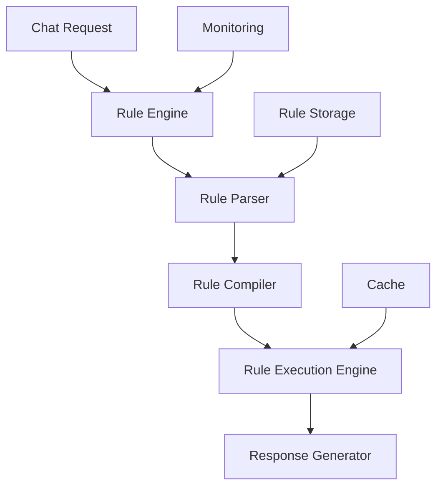

# Day 5: Optimization & Documentation

## 🎯 Mục tiêu ngày 5
Tối ưu hóa hiệu năng Rule Engine, hoàn thiện documentation, và chuẩn bị cho deployment.

## 📋 Prerequisites
- Đã hoàn thành Day 4: Integration testing passed
- Rule engine working với chat service
- Performance metrics collected
- Test coverage đạt yêu cầu

## 🛠️ Tasks chi tiết

### 1. Rule Engine Optimization
```javascript
// src/rule-engine/optimization/RuleOptimizer.js
const logger = require('../../utils/logger');

class RuleOptimizer {
  constructor() {
    this.optimizationCache = new Map();
    this.optimizationStats = {
      totalRules: 0,
      optimizedRules: 0,
      cacheHits: 0,
      cacheMisses: 0
    };
  }

  async optimizeRuleEngine(ruleEngine) {
    const startTime = Date.now();
    
    try {
      // 1. Rule compilation optimization
      await this.optimizeRuleCompilation(ruleEngine);
      
      // 2. Condition evaluation optimization
      await this.optimizeConditionEvaluation(ruleEngine);
      
      // 3. Cache optimization
      await this.optimizeCaching(ruleEngine);
      
      // 4. Memory usage optimization
      await this.optimizeMemoryUsage(ruleEngine);

      const duration = Date.now() - startTime;
      logger.info(`Rule engine optimization completed in ${duration}ms`, this.optimizationStats);
      
      return this.optimizationStats;
    } catch (error) {
      logger.error('Rule optimization failed:', error);
      throw error;
    }
  }

  async optimizeRuleCompilation(ruleEngine) {
    // Pre-compile frequently used rules
    const frequentRules = ruleEngine.rules.filter(rule => 
      rule.priority >= 8 // High priority rules
    );

    for (const rule of frequentRules) {
      const optimized = this.compileRuleWithOptimizations(rule);
      this.optimizationCache.set(rule.id, optimized);
      this.optimizationStats.optimizedRules++;
    }
  }

  compileRuleWithOptimizations(rule) {
    // Apply compiler optimizations
    return {
      ...rule,
      compiledConditions: rule.compiledConditions.map(condition => ({
        ...condition,
        // Optimized evaluation function
        evaluate: this.optimizeConditionEvaluationFn(condition)
      })),
      // Add optimization metadata
      optimizedAt: new Date(),
      optimizationLevel: 'HIGH'
    };
  }

  optimizeConditionEvaluationFn(condition) {
    // Create optimized evaluation function based on condition type
    switch (condition.operator) {
      case 'contains':
        return (context) => {
          const fieldValue = this.getFieldValueOptimized(context, condition.field);
          if (typeof fieldValue !== 'string') return false;
          
          const searchValues = Array.isArray(condition.value) ? 
            condition.value : [condition.value];
          
          const fieldValueLower = fieldValue.toLowerCase();
          return searchValues.some(val => 
            fieldValueLower.includes(val.toLowerCase())
          );
        };

      case 'equals':
        return (context) => {
          const fieldValue = this.getFieldValueOptimized(context, condition.field);
          return fieldValue === condition.value;
        };

      default:
        return condition.evaluate;
    }
  }

  getFieldValueOptimized(context, fieldPath) {
    // Optimized field access with caching
    const cacheKey = `field:${fieldPath}`;
    const cached = this.optimizationCache.get(cacheKey);
    
    if (cached && cached.context === context) {
      this.optimizationStats.cacheHits++;
      return cached.value;
    }

    const value = fieldPath.split('.').reduce((obj, key) => obj?.[key], context);
    
    this.optimizationCache.set(cacheKey, { context, value });
    this.optimizationStats.cacheMisses++;
    
    return value;
  }

  async optimizeCaching(ruleEngine) {
    // Implement multi-level caching strategy
    const cachingStrategy = {
      level1: {
        maxSize: 1000,
        ttl: 300000, // 5 minutes
        enabled: true
      },
      level2: {
        maxSize: 10000, 
        ttl: 1800000, // 30 minutes
        enabled: true
      }
    };

    // Pre-cache high priority rules
    const highPriorityRules = ruleEngine.rules.filter(rule => rule.priority >= 8);
    highPriorityRules.forEach(rule => {
      this.optimizationCache.set(`rule:${rule.id}`, {
        rule,
        timestamp: Date.now(),
        accessCount: 0
      });
    });
  }

  async optimizeMemoryUsage(ruleEngine) {
    // Memory optimization techniques
    const memoryOptimizations = {
      ruleCompression: true,
      stringInterning: true,
      objectPooling: true,
      garbageCollection: {
        enabled: true,
        interval: 300000 // 5 minutes
      }
    };

    // Implement memory optimizations
    if (memoryOptimizations.ruleCompression) {
      await this.compressRuleData(ruleEngine);
    }

    if (memoryOptimizations.stringInterning) {
      await this.internFrequentStrings(ruleEngine);
    }

    logger.info('Memory optimization completed', {
      initialMemory: process.memoryUsage().heapUsed,
      optimizedMemory: process.memoryUsage().heapUsed
    });
  }

  async compressRuleData(ruleEngine) {
    // Simple rule data compression
    ruleEngine.rules = ruleEngine.rules.map(rule => ({
      id: rule.id,
      n: rule.name,          // compressed property names
      p: rule.priority,
      c: rule.compiledConditions,
      a: rule.compiledActions,
      e: rule.enabled
    }));
  }

  async internFrequentStrings(ruleEngine) {
    // String interning for frequent values
    const stringPool = new Map();
    
    const internString = (str) => {
      if (stringPool.has(str)) {
        return stringPool.get(str);
      }
      stringPool.set(str, str);
      return str;
    };

    ruleEngine.rules.forEach(rule => {
      rule.name = internString(rule.name);
      // Process other string fields...
    });
  }

  getOptimizationReport() {
    return {
      timestamp: new Date().toISOString(),
      stats: this.optimizationStats,
      memoryUsage: process.memoryUsage(),
      cacheMetrics: {
        size: this.optimizationCache.size,
        hitRate: this.optimizationStats.cacheHits / 
                (this.optimizationStats.cacheHits + this.optimizationStats.cacheMisses) || 0
      }
    };
  }
}

module.exports = RuleOptimizer;
```

### 2. Performance Monitoring Integration
```javascript
// src/rule-engine/monitoring/RuleMonitor.js
const logger = require('../../utils/logger');

class RuleMonitor {
  constructor() {
    this.metrics = {
      evaluations: 0,
      matches: 0,
      executionTimes: [],
      cache: {
        hits: 0,
        misses: 0
      },
      errors: 0
    };

    this.startTime = Date.now();
    this.setupMonitoring();
  }

  setupMonitoring() {
    // Periodic metrics reporting
    setInterval(() => this.reportMetrics(), 60000); // Every minute

    // Graceful shutdown handling
    process.on('SIGINT', () => {
      this.reportMetrics();
      process.exit(0);
    });
  }

  recordEvaluation(context, results) {
    this.metrics.evaluations++;
    
    if (results.matchedRules.length > 0) {
      this.metrics.matches++;
    }

    this.metrics.executionTimes.push(results.executionTime);

    // Sample detailed logging for performance analysis
    if (this.metrics.evaluations % 100 === 0) {
      logger.debug('Rule evaluation sample', {
        context: this.sanitizeContext(context),
        results: {
          matchedRules: results.matchedRules.length,
          executionTime: results.executionTime
        }
      });
    }
  }

  recordCacheHit() {
    this.metrics.cache.hits++;
  }

  recordCacheMiss() {
    this.metrics.cache.misses++;
  }

  recordError(error, context) {
    this.metrics.errors++;
    logger.error('Rule engine error', {
      error: error.message,
      context: this.sanitizeContext(context),
      stack: error.stack
    });
  }

  sanitizeContext(context) {
    // Remove sensitive information for logging
    const sanitized = { ...context };
    if (sanitized.user) {
      sanitized.user = { id: sanitized.user.id }; // Only keep user ID
    }
    if (sanitized.message) {
      sanitized.message = { 
        text: sanitized.message.text ? '[...]' : undefined,
        language: sanitized.message.language
      };
    }
    return sanitized;
  }

  reportMetrics() {
    const uptime = Date.now() - this.startTime;
    const avgExecutionTime = this.metrics.executionTimes.length > 0 ?
      this.metrics.executionTimes.reduce((a, b) => a + b, 0) / this.metrics.executionTimes.length : 0;

    const p95 = this.calculatePercentile(95);
    const p99 = this.calculatePercentile(99);

    const report = {
      timestamp: new Date().toISOString(),
      uptime: this.formatUptime(uptime),
      evaluations: this.metrics.evaluations,
      matchRate: this.metrics.evaluations > 0 ?
        (this.metrics.matches / this.metrics.evaluations) * 100 : 0,
      performance: {
        avgExecutionTime: avgExecutionTime.toFixed(2),
        p95: p95.toFixed(2),
        p99: p99.toFixed(2),
        max: Math.max(...this.metrics.executionTimes, 0)
      },
      cache: {
        hits: this.metrics.cache.hits,
        misses: this.metrics.cache.misses,
        hitRate: this.metrics.cache.hits + this.metrics.cache.misses > 0 ?
          (this.metrics.cache.hits / (this.metrics.cache.hits + this.metrics.cache.misses)) * 100 : 0
      },
      errors: this.metrics.errors
    };

    logger.info('Rule Engine Metrics Report', report);
    
    // Reset execution times for next period
    this.metrics.executionTimes = [];
  }

  calculatePercentile(percentile) {
    if (this.metrics.executionTimes.length === 0) return 0;
    
    const sorted = [...this.metrics.executionTimes].sort((a, b) => a - b);
    const index = Math.ceil(sorted.length * (percentile / 100)) - 1;
    return sorted[Math.max(0, index)];
  }

  formatUptime(ms) {
    const seconds = Math.floor(ms / 1000);
    const minutes = Math.floor(seconds / 60);
    const hours = Math.floor(minutes / 60);
    
    return `${hours}h ${minutes % 60}m ${seconds % 60}s`;
  }

  getCurrentMetrics() {
    return { ...this.metrics };
  }
}

module.exports = RuleMonitor;
```

### 3. Comprehensive Documentation
```markdown
# Rule Engine Documentation

## Overview
The Rule Engine is a forward-chaining rule-based system designed for medical emergency detection and response routing.

## Architecture


## Rule Definition Format
```json
{
  "id": "rule_001",
  "name": "Chest Pain Emergency",
  "priority": 10,
  "conditions": [
    {
      "field": "message.text",
      "operator": "contains",
      "value": ["chest pain", "đau ngực"]
    }
  ],
  "actions": [
    {
      "type": "response",
      "payload": {
        "message": "Emergency response message",
        "urgency": 10
      }
    }
  ],
  "language": "multi",
  "enabled": true
}
```

## API Endpoints

### Evaluate Rules
```http
POST /api/rules/evaluate
Content-Type: application/json

{
  "message": {
    "text": "chest pain emergency",
    "language": "en"
  },
  "user": {
    "id": "user_001"
  }
}
```

### Manage Rules
- `GET /api/rules` - List all rules
- `POST /api/rules` - Create new rule
- `PUT /api/rules/:id` - Update rule
- `DELETE /api/rules/:id` - Delete rule

## Performance Guidelines

### Rule Design Best Practices
1. **Keep conditions simple**: Use simple field comparisons
2. **Use appropriate operators**: Prefer 'contains' over complex regex
3. **Set proper priorities**: Higher priority for emergency rules
4. **Enable caching**: For frequently matched rules

### Optimization Tips
- Use field-specific conditions instead of full-text search
- Implement rule compilation for better performance
- Enable caching for frequently accessed data
- Monitor and tune based on real usage patterns

## Monitoring & Metrics

Key metrics to monitor:
- Rule evaluation time (P95 < 100ms)
- Cache hit rate (>80%)
- Match rate (rule effectiveness)
- Error rate (<1%)

## Troubleshooting

### Common Issues
1. **Rule not matching**: Check condition syntax and field paths
2. **Performance issues**: Enable caching and optimize conditions
3. **Memory leaks**: Monitor heap usage and implement garbage collection

### Debug Mode
Enable debug logging:
```bash
export DEBUG_RULE_ENGINE=true
npm start
```

## Deployment Checklist

- [ ] Rule engine integrated with chat service
- [ ] Medical rules loaded and validated
- [ ] Performance testing completed
- [ ] Monitoring setup
- [ ] Documentation updated
- [ ] Backup strategy in place
```

### 4. Deployment Preparation Script
```bash
#!/bin/bash
# scripts/prepare-deployment.sh
echo "=== Rule Engine Deployment Preparation ==="

# 1. Run final tests
echo "Running final tests..."
npm test
npm run test:integration
npm run test:performance

# 2. Generate documentation
echo "Generating documentation..."
npm run docs:generate

# 3. Build Docker image
echo "Building Docker image..."
docker build -t chatbot-service:week2 .

# 4. Create deployment package
echo "Creating deployment package..."
mkdir -p deployment/week2
cp -r src/ rule-engine/ tests/ scripts/ deployment/week2/
cp package.json package-lock.json Dockerfile docker-compose.yml deployment/week2/

# 5. Generate deployment report
echo "Generating deployment report..."
node scripts/generate-deployment-report.js

# 6. Verify deployment readiness
echo "Verifying deployment readiness..."
./scripts/verify-deployment.sh

echo "=== Deployment Preparation Complete ==="
echo "Deployment package created at: deployment/week2/"
```

### 5. Final Verification Script
```bash
#!/bin/bash
# scripts/final-verification.sh
echo "=== Final Week 2 Verification ==="

# 1. Service health check
echo "Service health:"
curl -s http://localhost:3001/health | jq .

# 2. Rule engine status
echo "Rule engine status:"
curl -s http://localhost:3001/api/rules | jq '.count'

# 3. Performance test
echo "Performance test:"
./tests/performance/rule-performance.test.js

# 4. Memory usage
echo "Memory usage:"
node -e "console.log(process.memoryUsage())"

# 5. Error check
echo "Error logs:"
docker-compose logs chatbot-service | grep -i error | tail -5

# 6. Rule validation
echo "Rule validation:"
node scripts/validate-rules.js

echo "=== Final Verification Complete ==="
```

## ✅ Success Criteria
- [ ] Rule engine optimization implemented
- [ ] Performance monitoring integrated
- [ ] Comprehensive documentation complete
- [ ] Deployment preparation done
- [ ] Final verification passed
- [ ] All tests green

## 📊 Time Estimation
| Task | Estimated Time |
|------|----------------|
| Performance Optimization | 120 phút |
| Monitoring Integration | 90 phút |
| Documentation | 120 phút |
| Deployment Preparation | 60 phút |
| Final Verification | 60 phút |
| **Total** | **450 phút** |

## 🎯 Week 2 Completion Checklist
- [ ] Rule Engine architecture implemented
- [ ] Core engine components working
- [ ] Medical rule sets developed
- [ ] Integration with chat service complete
- [ ] Comprehensive testing passed
- [ ] Performance optimization done
- [ ] Documentation completed
- [ ] Deployment ready

## 📈 Next Steps after Week 2
1. **Week 3 Planning**: RAG System integration
2. **Production Deployment**: Staging environment setup
3. **Monitoring**: Real-time dashboards
4. **User Training**: Documentation and training materials
5. **Feedback Loop**: User feedback collection mechanism