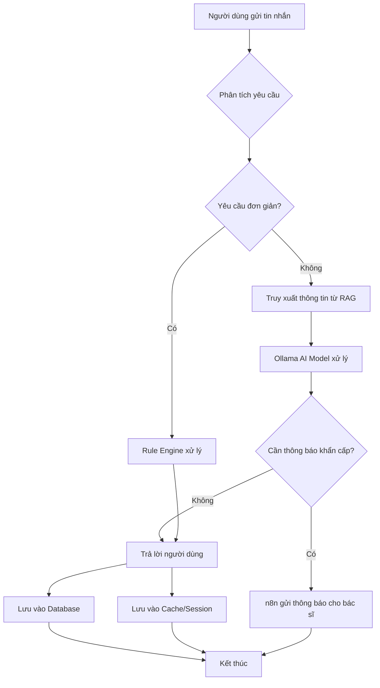
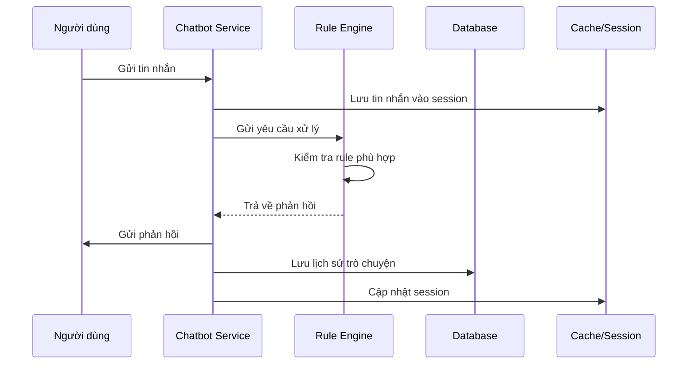
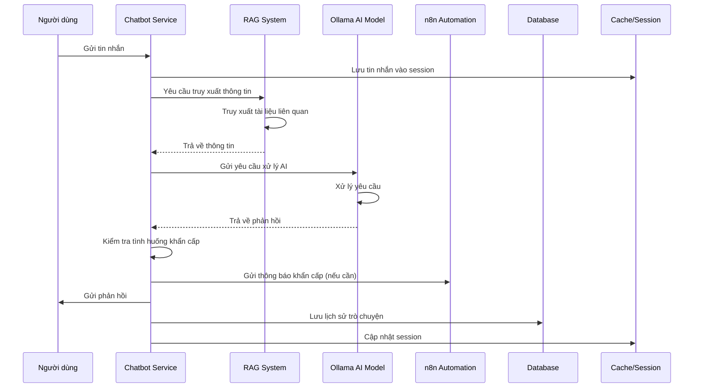

# Flow Xử lý của Chatbot Service

## 1. Flow Xử lý Tổng quan

Flow xử lý tổng quan của Chatbot Service được mô tả trong diagram dưới đây:

## 2. Flow Xử lý Chi tiết

### 2.1. Nhận và Phân tích Yêu cầu

Khi người dùng gửi tin nhắn, Chatbot Service sẽ thực hiện các bước sau:

1. Nhận tin nhắn từ API Gateway
2. Lưu trữ tin nhắn vào Cache/Session Store để duy trì ngữ cảnh
3. Phân tích nội dung tin nhắn để xác định:
   - Mức độ phức tạp của yêu cầu
   - Có chứa thông tin y tế nhạy cảm không
   - Có cần phản hồi khẩn cấp không

### 2.2. Xử lý Yêu cầu Đơn giản

Đối với các yêu cầu đơn giản có thể xử lý bằng rule-based:

1. Chatbot Service gửi yêu cầu đến Rule Engine
2. Rule Engine kiểm tra tập luật để tìm rule phù hợp
3. Nếu tìm thấy rule phù hợp:
   - Rule Engine tạo phản hồi dựa trên rule
   - Trả phản hồi về cho Chatbot Service
4. Nếu không tìm thấy rule phù hợp:
   - Chuyển sang xử lý yêu cầu phức tạp

### 2.3. Xử lý Yêu cầu Phức tạp

Đối với các yêu cầu phức tạp cần AI xử lý:

1. Chatbot Service gửi yêu cầu đến RAG System
2. RAG System truy xuất thông tin liên quan từ tài liệu y tế
3. Chatbot Service gửi thông tin truy xuất được đến Ollama AI Model
4. Ollama AI Model xử lý yêu cầu và tạo phản hồi
5. Chatbot Service nhận phản hồi từ Ollama AI Model

### 2.4. Kiểm tra Tình huống Khẩn cấp

Sau khi có phản hồi, Chatbot Service sẽ kiểm tra xem có cần thông báo khẩn cấp không:

1. Phân tích nội dung phản hồi và tin nhắn gốc
2. Nếu phát hiện tình huống khẩn cấp:
   - Gửi yêu cầu đến n8n Automation
   - n8n Automation xác định bác sĩ đang trực
   - Gửi thông báo khẩn cấp đến bác sĩ
3. Nếu không có tình huống khẩn cấp:
   - Tiếp tục quy trình trả lời người dùng

### 2.5. Trả lời Người dùng

1. Chatbot Service chuẩn bị phản hồi cuối cùng
2. Gửi phản hồi qua API Gateway đến người dùng
3. Cập nhật ngữ cảnh trong Cache/Session Store
4. Lưu trữ lịch sử trò chuyện vào Database

## 3. Flow Xử lý trong Các Tình huống Đặc biệt

### 3.1. Khi Người dùng Cung cấp Thông tin Y tế

1. Người dùng gửi thông tin y tế (huyết áp, nhịp tim, v.v.)
2. Chatbot Service lưu trữ thông tin vào Cache/Session Store
3. Nếu thông số bất thường:
   - Gửi cảnh báo đến người dùng
   - Kiểm tra cần thông báo bác sĩ không
4. Cập nhật hồ sơ sức khỏe của người dùng

### 3.2. Khi Người dùng Yêu cầu Trợ giúp Khẩn cấp

1. Người dùng yêu cầu trợ giúp khẩn cấp
2. Chatbot Service xác định mức độ khẩn cấp
3. Gửi yêu cầu đến n8n Automation ngay lập tức
4. n8n Automation thông báo đến bác sĩ đang trực
5. Cung cấp thông tin liên lạc cho người dùng

### 3.3. Khi Hệ thống Quá tải

1. Hệ thống phát hiện quá tải
2. Tự động chuyển hướng một số yêu cầu đến Rule Engine
3. Ưu tiên xử lý các yêu cầu khẩn cấp
4. Thông báo cho người dùng về độ trễ dự kiến

## 4. Flow Xử lý cho Các Tính năng Nâng cao

### 4.1. Học hỏi từ Phản hồi

1. Thu thập phản hồi từ người dùng về chất lượng phản hồi
2. Phân tích phản hồi để cải thiện:
   - Rule Engine
   - RAG System
   - Ollama AI Model
3. Cập nhật các thành phần tương ứng

### 4.2. Tích hợp với Thiết bị Y tế

1. Nhận dữ liệu từ thiết bị y tế
2. Phân tích dữ liệu để phát hiện bất thường
3. Tự động tạo cảnh báo nếu cần
4. Lưu trữ dữ liệu vào hồ sơ sức khỏe

## 5. Diagram Chi tiết cho Các Flow Xử lý

### 5.1. Flow xử lý yêu cầu đơn giản

### 5.2. Flow xử lý yêu cầu phức tạp

## 6. Xử lý Lỗi và Ngoại lệ

### 6.1. Khi Ollama AI Model không phản hồi

1. Chatbot Service phát hiện timeout
2. Chuyển sang Rule Engine để xử lý
3. Thông báo lỗi cho người dùng
4. Ghi log sự kiện

### 6.2. Khi RAG System không tìm thấy thông tin

1. RAG System trả về kết quả trống
2. Chatbot Service gửi yêu cầu trực tiếp đến Ollama AI Model
3. Ollama AI Model xử lý với kiến thức chung
4. Trả phản hồi cho người dùng

### 6.3. Khi Database không khả dụng

1. Chatbot Service phát hiện lỗi kết nối Database
2. Tiếp tục xử lý yêu cầu nhưng không lưu lịch sử
3. Thông báo lỗi cho hệ thống giám sát
4. Chuyển sang chế độ chỉ đọc nếu cần