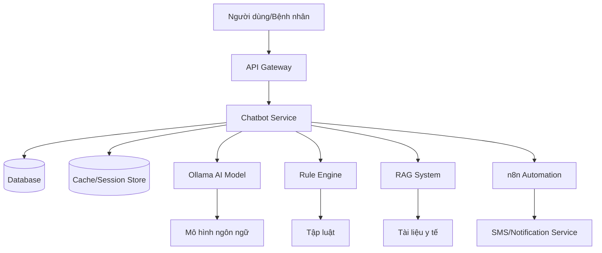

# Chatbot Service cho Dự án Chăm sóc Sức khỏe Thông minh

## Tổng quan

Chatbot Service là một thành phần quan trọng trong Dự án Chăm sóc Sức khỏe Thông minh dành cho bệnh nhân tim mạch. Service này cung cấp khả năng tương tác tự nhiên với bệnh nhân thông qua AI, giúp hỗ trợ theo dõi sức khỏe, cung cấp thông tin y tế và cảnh báo khi có tình huống khẩn cấp.

## Tính năng chính

1. **Tương tác thông minh**: Sử dụng mô hình ngôn ngữ AI để hiểu và phản hồi các câu hỏi của bệnh nhân.
2. **Quản lý ngữ cảnh**: Nhớ được thông tin từ các tin nhắn trước trong cùng một cuộc trò chuyện.
3. **Xử lý rule-based**: Áp dụng tập luật có sẵn để xử lý các tình huống thông thường.
4. **Truy xuất thông tin y tế**: Sử dụng kỹ thuật RAG để truy xuất thông tin từ các tài liệu y tế uy tín.
5. **Tự động hóa**: Tích hợp với n8n để tự động hóa các quy trình như gửi thông báo cho bác sĩ khi có tình huống khẩn cấp.
6. **Lưu trữ lịch sử**: Lưu trữ toàn bộ lịch sử trò chuyện để phục vụ cho việc phân tích, cải tiến và fine-tune model.

## Công nghệ sử dụng

- **Ollama**: Nền tảng chạy mô hình ngôn ngữ mở
- **Rule Engine**: Engine xử lý logic dựa trên tập luật
- **RAG System**: Hệ thống truy xuất thông tin tăng cường
- **n8n**: Nền tảng tự động hóa workflow
- **Redis**: Bộ nhớ cache/session store
- **MySQL**: Cơ sở dữ liệu lưu trữ lịch sử trò chuyện (đã chuyển từ PostgreSQL để tối ưu cho LLM)
- **Docker**: Container hóa service

## Kiến trúc tổng quan

## Cài đặt và chạy thử

Hướng dẫn chi tiết về cài đặt và chạy thử service sẽ được cập nhật trong file deployment.md.

## Tài liệu tham khảo

- [Kiến trúc chi tiết](./architecture.md)
- [Các thành phần chính](./components.md)
- [Flow xử lý](./workflow.md)
- [Hướng dẫn triển khai](./deployment.md)
- [Tính năng bổ sung](./features.md)
- [Lộ trình phát triển](./roadmap.md)