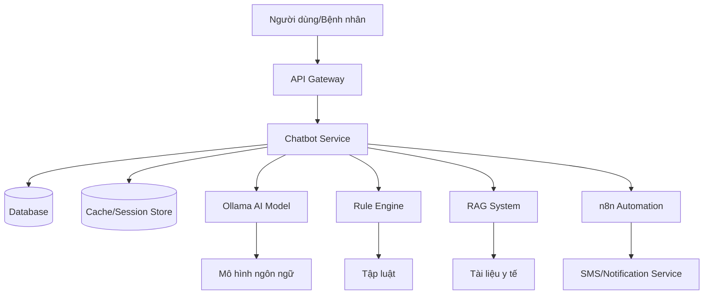

# Kiến trúc Hệ thống Chatbot Service

## Tổng quan

Kiến trúc của Chatbot Service được thiết kế theo mô hình microservices, cho phép mở rộng và bảo trì dễ dàng. Service này tương tác với nhiều thành phần khác nhau để cung cấp trải nghiệm chatbot thông minh cho bệnh nhân tim mạch.

## Kiến trúc Tổng quan

## Các Thành phần Chi tiết

### 1. Chatbot Service Core

**Vị trí**: Trung tâm của toàn bộ hệ thống

**Chức năng**:
- Nhận và xử lý các yêu cầu từ người dùng qua API Gateway
- Điều phối luồng xử lý giữa các thành phần khác nhau
- Quản lý ngữ cảnh của cuộc trò chuyện
- Trả lời người dùng

**Công nghệ**:
- Node.js/Express hoặc Python/FastAPI
- Docker container

### 2. Ollama AI Model

**Vị trí**: Thành phần AI xử lý ngôn ngữ tự nhiên

**Chức năng**:
- Chạy mô hình ngôn ngữ mở để hiểu và tạo phản hồi tự nhiên
- Xử lý các yêu cầu phức tạp cần suy luận
- Có thể được public qua tunnel (ngrok/cloudflare) nếu cần

**Công nghệ**:
- Ollama platform
- Mô hình Llama hoặc tương tự

### 3. Rule Engine

**Vị trí**: Thành phần xử lý logic dựa trên tập luật

**Chức năng**:
- Xử lý các trường hợp thông thường dựa trên tập luật đã có
- Cung cấp phản hồi nhanh cho các câu hỏi đơn giản
- Giảm tải cho AI model bằng cách xử lý các yêu cầu đơn giản

**Công nghệ**:
- Custom rule engine hoặc sử dụng Drools
- Tập luật được định nghĩa trong file cấu hình

### 4. RAG System (Retrieval-Augmented Generation)

**Vị trí**: Thành phần truy xuất thông tin y tế

**Chức năng**:
- Truy xuất thông tin từ các tài liệu y tế uy tín
- Cung cấp kiến thức chuyên môn cho AI model
- Đảm bảo tính chính xác của lời khuyên y tế

**Công nghệ**:
- Vector database (Pinecone, Weaviate, hoặc Chroma)
- Embedding model
- Tài liệu y tế được vector hóa

### 5. n8n Automation

**Vị trí**: Thành phần tự động hóa workflow

**Chức năng**:
- Tự động hóa các quy trình như gửi thông báo cho bác sĩ
- Xử lý các tình huống khẩn cấp
- Tích hợp với các dịch vụ bên ngoài (SMS, email, v.v.)

**Công nghệ**:
- n8n platform
- Workflow được định nghĩa trong file JSON

### 6. Database

**Vị trí**: Thành phần lưu trữ dữ liệu lâu dài

**Chức năng**:
- Lưu trữ lịch sử trò chuyện để phục vụ cho:
  - Lưu trữ lâu dài
  - Testing
  - Fine-tune model trong tương lai

**Công nghệ**:
- PostgreSQL hoặc MongoDB
- Docker container

### 7. Cache/Session Store

**Vị trí**: Thành phần lưu trữ tạm thời

**Chức năng**:
- Lưu trữ context của cuộc trò chuyện hiện tại
- Giúp mô hình nhớ được thông tin từ các tin nhắn trước như:
  - Tên bệnh nhân
  - Triệu chứng đã mô tả
  - Thông số sức khỏe đã gửi

**Công nghệ**:
- Redis
- Docker container

## Luồng Dữ liệu

1. Người dùng gửi tin nhắn qua API Gateway
2. API Gateway chuyển tiếp yêu cầu đến Chatbot Service
3. Chatbot Service lưu trữ tin nhắn vào Cache/Session Store
4. Chatbot Service phân tích yêu cầu:
   - Nếu là yêu cầu đơn giản, gửi đến Rule Engine
   - Nếu là yêu cầu phức tạp, thực hiện các bước sau:
     a. Truy xuất thông tin từ RAG System
     b. Gửi thông tin đến Ollama AI Model
     c. Nhận phản hồi từ AI Model
5. Chatbot Service kiểm tra xem có cần gửi thông báo khẩn cấp không:
   - Nếu có, kích hoạt n8n Automation
6. Chatbot Service trả lời người dùng qua API Gateway
7. Lưu trữ lịch sử trò chuyện vào Database

## Mở rộng và Bảo trì

Kiến trúc này cho phép:
- Mở rộng từng thành phần độc lập
- Thay thế công nghệ trong từng thành phần mà không ảnh hưởng đến toàn bộ hệ thống
- Dễ dàng bảo trì và cập nhật
- Tăng cường bảo mật bằng cách tách biệt các thành phần