# Smart Health Backend - Class Diagram (Final Version)

## PlantUML Class Diagram

```plantuml
@startuml Smart Health Backend - All Classes

skinparam classAttributeIconSize 0
skinparam nodesep 60
skinparam ranksep 80

' ==================== AUTH SERVICE CLASSES ====================

class User {
  - userId: UUID
  - username: String
  - email: String
  - passwordHash: String
  - role: Role
  - createdAt: LocalDateTime
  - isActive: Boolean
  --
  + getAuthorities(): Collection<GrantedAuthority>
  + getPassword(): String
  + getUsername(): String
  + isEnabled(): Boolean
}

class RefreshToken {
  - tokenId: UUID
  - token: String
  - expiryDate: LocalDateTime
  - createdAt: LocalDateTime
}

' ==================== PATIENT SERVICE CLASSES ====================

class Patient {
  - patientId: string
  - user_id: string
  - full_name: string
  - date_of_birth: Date
  - gender: Gender
  - address: string
  - phone: string
  - created_at: Date
  - updated_at: Date
}

' ==================== DOCTOR SERVICE CLASSES ====================

class Doctor {
  - doctorId: string
  - full_name: string
  - display_name: string
  - user_id: string
  - gender: Gender
  - room_number: string
  - date_of_birth: Date
  - avatar: string
  - experience_years: int
  - bio: text
  - phone: string
  - created_at: Date
  - updated_at: Date
}

class DoctorCertificate {
  - certificateId: string
  - doctor_id: string
  - type: CertificateType
  - academic_degree: AcademicDegree
  - field: string
  - graduation_year: number
  - license_number: string
  - issued_date: Date
  - expiry_date: Date
  - issued_by: string
  - description: text
  - certificate_file: string
  - status: string
  - is_verified: boolean
  - verified_at: Date
  - verified_by: string
  - created_at: Date
  - updated_at: Date
}

class DoctorRating {
  - ratingId: string
  - doctor_id: string
  - rating: int
  - comment: text
  - patient_id: string
  - created_at: Date
}

class AppointmentSlot {
  - slotId: string
  - doctor_id: string
  - start_time: Date
  - end_time: Date
  - status: string
  - patient_id: string
  - created_at: Date
  - updated_at: Date
}

class DoctorWeeklyAvailability {
  - availabilityId: string
  - doctor_id: string
  - day_of_week: DayOfWeek
  - start_time: string
  - end_time: string
  - created_at: Date
  - updated_at: Date
}

class DoctorSpecialAvailability {
  - specialAvailabilityId: string
  - doctor_id: string
  - date: string
  - start_time: string
  - end_time: string
  - created_at: Date
  - updated_at: Date
}

class DoctorBlockTime {
  - blockTimeId: string
  - doctor_id: string
  - start_block: Date
  - end_block: Date
  - reason: string
  - created_at: Date
  - updated_at: Date
}

' ==================== APPOINTMENT SERVICE CLASSES ====================

class Appointment {
  - appointmentId: string
  - doctorId: string
  - doctorName: string
  - patientId: string
  - patientName: string
  - slotId: string
  - status: AppointmentStatus
  - type: AppointmentType
  - category: AppointmentCategory
  - roomNumber: string
  - notes: text
  - startAt: Date
  - endAt: Date
  - paymentStatus: PaymentStatus
  - paymentId: string
  - paymentUrl: string
  - paidAmount: decimal
  - paidAt: Date
  - checkedInAt: Date
  - consultationFee: decimal
  - followUpId: string
  - createdAt: Date
  - updatedAt: Date
}

class MedicalRecord {
  - recordId: string
  - appointment_id: string
  - symptoms: text
  - diagnosis: text
  - doctorNotes: text
  - prescription: text
  - prescriptionId: string
  - createdAt: Date
  - updatedAt: Date
}

class VitalSign {
  - vitalSignId: string
  - medical_record_id: string
  - lab_test_order_id: string
  - temperature: float
  - heartRate: float
  - systolicPressure: float
  - diastolicPressure: float
  - oxygenSaturation: float
  - height: float
  - weight: float
  - bmi: float
  - bloodSugar: float
  - cholesterolTotal: float
  - hdl: float
  - ldl: float
  - triglycerides: float
  - creatinine: float
  - urineProtein: float
  - urinePH: float
  - urineSugar: float
  - status: VitalSignStatus
  - notes: text
  - recordedBy: string
  - recordedAt: Date
  - createdAt: Date
  - updatedAt: Date
}

class LabTest {
  - testId: string
  - name: string
  - code: string
  - description: string
  - price: decimal
  - isActive: boolean
  - type: LabTestType
  - createdAt: Date
  - updatedAt: Date
}

class LabTestOrder {
  - orderId: string
  - appointmentId: string
  - type: LabTestType
  - status: LabTestOrderStatus
  - orderedBy: string
  - paymentId: string
  - labTestId: string
  - createdAt: Date
  - updatedAt: Date
}

class LabTestResult {
  - resultId: string
  - lab_test_order_id: string
  - resultFile: string
  - summary: text
  - enteredBy: string
  - bloodSugar: float
  - cholesterolTotal: float
  - hdl: float
  - ldl: float
  - triglycerides: float
  - creatinine: float
  - urineProtein: float
  - urinePH: float
  - urineSugar: float
  - createdAt: Date
  - updatedAt: Date
}

class FollowUpSuggestion {
  - suggestionId: string
  - medicalRecordId: string
  - doctorId: string
  - patientId: string
  - suggestedDate: Date
  - reason: text
  - status: FollowUpSuggestionStatus
  - createdAt: Date
  - updatedAt: Date
}

' ==================== BILLING SERVICE CLASSES ====================

class Payment {
  - paymentId: Long
  - paymentCode: String
  - paymentType: PaymentType
  - referenceId: String
  - appointmentId: String
  - prescriptionId: String
  - amount: BigDecimal
  - status: PaymentStatus
  - paymentMethod: PaymentMethodType
  - paymentUrl: String
  - transactionId: String
  - description: String
  - createdAt: LocalDateTime
  - updatedAt: LocalDateTime
  - expiredAt: LocalDateTime
  - paidAt: LocalDateTime
  - metadata: String
}

' ==================== MEDICINE SERVICE CLASSES ====================

class PrescriptionTemplate {
  - templateId: Long
  - doctorId: String
  - templateName: String
  - diagnosis: String
  - notes: String
  - createdAt: LocalDateTime
  - updatedAt: LocalDateTime
  --
  + addItem(item: PrescriptionTemplateItem): void
  + removeItem(item: PrescriptionTemplateItem): void
}

class PrescriptionTemplateItem {
  - itemId: Long
  - template_id: Long
  - drug_id: Long
  - dosage: String
  - frequency: String
  - route: String
  - timing: String
  - durationDays: Integer
  - specialInstructions: String
}

class Drug {
  - drugId: Long
  - name: String
  - activeIngredient: String
  - dosageForm: String
  - manufacturer: String
  - price: BigDecimal
}

' ==================== PREDICTION SERVICE CLASSES (MongoDB) ====================

class PredictionLog {
  - _id: ObjectId
  - features: Map<String, Any>
  - result: float
  - model_version: String
  - created_at: datetime
  - patient_id: String
  - doctor_id: String
}

' ==================== NOTIFICATION SERVICE CLASSES ====================

class UserDevice {
  - deviceId: string
  - userId: string
  - deviceToken: text
  - deviceType: DeviceType
  - isActive: boolean
  - createdAt: Date
  - updatedAt: Date
}

' ==================== RELATIONSHIPS ====================

' Auth Service Relationships
User "1" -- "0..*" RefreshToken : has >

' Doctor Service Relationships
Doctor "1" -- "0..*" DoctorCertificate : has >
Doctor "1" -- "0..*" DoctorRating : receives >
Doctor "1" -- "0..*" AppointmentSlot : manages >
Doctor "1" -- "0..*" DoctorWeeklyAvailability : has >
Doctor "1" -- "0..*" DoctorSpecialAvailability : has >
Doctor "1" -- "0..*" DoctorBlockTime : has >

' Appointment Service Relationships
Appointment "1" -- "0..1" MedicalRecord : has >
Appointment "1" -- "0..*" LabTestOrder : includes >
MedicalRecord "1" -- "0..1" VitalSign : has >
MedicalRecord "1" -- "0..*" FollowUpSuggestion : generates >
LabTestOrder "1" -- "0..1" LabTestResult : has >
LabTestOrder "*" -- "1" LabTest : references >
LabTestOrder "1" -- "0..*" VitalSign : updates >
FollowUpSuggestion "0..1" -- "0..1" Appointment : creates >
Appointment "0..1" -- "0..1" FollowUpSuggestion : from >

' Billing Service Relationships
Payment "0..1" -- "0..*" Payment : parent-child >

' Medicine Service Relationships
PrescriptionTemplate "1" -- "0..*" PrescriptionTemplateItem : contains >
PrescriptionTemplateItem "*" -- "1" Drug : uses >

' Cross-Service Relationships (via ID references)
User "1" ..> "0..1" Patient : manages\n(user_id)
User "1" ..> "0..1" Doctor : manages\n(user_id)
Doctor ..> Appointment : serves\n(doctorId)
Patient ..> Appointment : books\n(patientId)
AppointmentSlot ..> Appointment : booked for\n(slotId)
Appointment ..> Payment : paid via\n(paymentId)
Doctor ..> PrescriptionTemplate : creates\n(doctorId)
MedicalRecord ..> PrescriptionTemplate : uses\n(prescriptionId)
User ..> UserDevice : owns\n(userId)
Patient ..> PredictionLog : has predictions\n(patient_id)
Doctor ..> PredictionLog : creates predictions\n(doctor_id)

' Notes
note top of User
  **Central authentication entity**
  Roles: PATIENT, DOCTOR, 
  RECEPTIONIST, ADMIN
end note

note top of Appointment
  **Core booking entity**
  Links patient, doctor, slot
  Tracks payment and status
end note

note bottom of MedicalRecord
  Created after appointment
  Contains diagnosis, prescription,
  vital signs, lab results
end note

note right of Payment
  Supports composite payments
  for bundled billing
  (appointment + labs + meds)
end note

note left of PrescriptionTemplate
  Reusable prescription templates
  created by doctors for
  common diagnoses
end note

@enduml
```

## Danh sách các Entity Classes với ID có nghĩa

### Auth Service (2 classes)
1. **User** - `userId` - Mã định danh tài khoản người dùng
2. **RefreshToken** - `tokenId` - Mã định danh token làm mới

### Patient Service (1 class)
3. **Patient** - `patientId` - Mã định danh bệnh nhân

### Doctor Service (7 classes)
4. **Doctor** - `doctorId` - Mã định danh bác sĩ
5. **DoctorCertificate** - `certificateId` - Mã định danh chứng chỉ
6. **DoctorRating** - `ratingId` - Mã định danh đánh giá
7. **AppointmentSlot** - `slotId` - Mã định danh khung giờ khám
8. **DoctorWeeklyAvailability** - `availabilityId` - Mã định danh lịch hàng tuần
9. **DoctorSpecialAvailability** - `specialAvailabilityId` - Mã định danh lịch đặc biệt
10. **DoctorBlockTime** - `blockTimeId` - Mã định danh thời gian chặn

### Appointment Service (7 classes)
11. **Appointment** - `appointmentId` - Mã định danh lịch hẹn
12. **MedicalRecord** - `recordId` - Mã định danh hồ sơ bệnh án
13. **VitalSign** - `vitalSignId` - Mã định danh chỉ số sức khỏe
14. **LabTest** - `testId` - Mã định danh loại xét nghiệm
15. **LabTestOrder** - `orderId` - Mã định danh yêu cầu xét nghiệm
16. **LabTestResult** - `resultId` - Mã định danh kết quả xét nghiệm
17. **FollowUpSuggestion** - `suggestionId` - Mã định danh đề xuất tái khám

### Billing Service (1 class)
18. **Payment** - `paymentId` - Mã định danh thanh toán

### Medicine Service (3 classes)
19. **PrescriptionTemplate** - `templateId` - Mã định danh mẫu đơn thuốc
20. **PrescriptionTemplateItem** - `itemId` - Mã định danh chi tiết mẫu đơn thuốc
21. **Drug** - `drugId` - Mã định danh thuốc

### Prediction Service (1 class - MongoDB)
22. **PredictionLog** - `_id` - Mã định danh bản ghi dự đoán (MongoDB ObjectId)

### Notification Service (1 class)
23. **UserDevice** - `deviceId` - Mã định danh thiết bị

## Tổng số: 23 Entity Classes

## Các cải tiến về tên thuộc tính ID

### So sánh trước và sau

| Class | Trước | Sau | Ý nghĩa |
|-------|-------|-----|---------|
| User | id | userId | Mã người dùng |
| RefreshToken | id | tokenId | Mã token |
| Patient | id | patientId | Mã bệnh nhân |
| Doctor | id | doctorId | Mã bác sĩ |
| DoctorCertificate | id | certificateId | Mã chứng chỉ |
| DoctorRating | id | ratingId | Mã đánh giá |
| AppointmentSlot | id | slotId | Mã khung giờ |
| DoctorWeeklyAvailability | id | availabilityId | Mã lịch tuần |
| DoctorSpecialAvailability | id | specialAvailabilityId | Mã lịch đặc biệt |
| DoctorBlockTime | id | blockTimeId | Mã thời gian chặn |
| Appointment | id | appointmentId | Mã lịch hẹn |
| MedicalRecord | id | recordId | Mã hồ sơ bệnh án |
| VitalSign | id | vitalSignId | Mã chỉ số sức khỏe |
| LabTest | id | testId | Mã loại xét nghiệm |
| LabTestOrder | id | orderId | Mã yêu cầu xét nghiệm |
| LabTestResult | id | resultId | Mã kết quả xét nghiệm |
| FollowUpSuggestion | id | suggestionId | Mã đề xuất tái khám |
| Payment | id | paymentId | Mã thanh toán |
| PrescriptionTemplate | id | templateId | Mã mẫu đơn thuốc |
| PrescriptionTemplateItem | id | itemId | Mã chi tiết mẫu |
| Drug | id | drugId | Mã thuốc |
| PredictionLog | _id | _id | ObjectId (MongoDB) |
| UserDevice | id | deviceId | Mã thiết bị |

## Mối quan hệ chính

### Trong cùng service (Solid lines)
- **Auth**: User ↔ RefreshToken (1-n)
- **Doctor**: Doctor có nhiều certificates, ratings, slots, availabilities, block times
- **Appointment**: Appointment ↔ MedicalRecord ↔ VitalSign ↔ LabTestOrder ↔ LabTestResult
- **Medicine**: PrescriptionTemplate ↔ PrescriptionTemplateItem ↔ Drug

### Giữa các service (Dotted lines - via ID)
- User → Patient/Doctor (user_id)
- Doctor → Appointment (doctorId)
- Patient → Appointment (patientId)
- AppointmentSlot → Appointment (slotId)
- Appointment → Payment (paymentId)
- Doctor → PrescriptionTemplate (doctorId)
- Patient → PredictionLog (patient_id)
- Doctor → PredictionLog (doctor_id)

## Ghi chú

- **Solid lines (—)**: Direct database relationships (foreign keys trong cùng service)
- **Dotted lines (..)**: Cross-service references (ID only, không có FK thực tế)
- **PredictionLog**: NoSQL document stored in MongoDB (giữ nguyên `_id` theo convention của MongoDB)
- **Naming Convention**: Tất cả ID đều có tên có nghĩa, thể hiện rõ entity mà nó đại diện
- **Consistency**: Foreign key references vẫn giữ nguyên tên gốc (user_id, doctor_id, patient_id, etc.) để phản ánh đúng cấu trúc database thực tế
