# Smart Health Backend - Class Diagram (Simplified)

## PlantUML Class Diagram

```plantuml
@startuml Smart Health Backend - All Classes

skinparam classAttributeIconSize 0
skinparam nodesep 60
skinparam ranksep 80

' ==================== AUTH SERVICE CLASSES ====================

class User {
  - id: UUID
  - username: String
  - email: String
  - passwordHash: String
  - role: Role
  - createdAt: LocalDateTime
  - isActive: Boolean
  --
  + getAuthorities(): Collection<GrantedAuthority>
  + getPassword(): String
  + getUsername(): String
  + isEnabled(): Boolean
}

class RefreshToken {
  - id: UUID
  - token: String
  - expiryDate: LocalDateTime
  - createdAt: LocalDateTime
}

' ==================== PATIENT SERVICE CLASSES ====================

class Patient {
  - id: string
  - user_id: string
  - full_name: string
  - date_of_birth: Date
  - gender: Gender
  - address: string
  - phone: string
  - created_at: Date
  - updated_at: Date
}

' ==================== DOCTOR SERVICE CLASSES ====================

class Doctor {
  - id: string
  - full_name: string
  - display_name: string
  - user_id: string
  - gender: Gender
  - room_number: string
  - date_of_birth: Date
  - avatar: string
  - experience_years: int
  - bio: text
  - phone: string
  - created_at: Date
  - updated_at: Date
}

class DoctorCertificate {
  - id: string
  - type: CertificateType
  - academic_degree: AcademicDegree
  - field: string
  - graduation_year: number
  - license_number: string
  - issued_date: Date
  - expiry_date: Date
  - issued_by: string
  - description: text
  - certificate_file: string
  - status: string
  - is_verified: boolean
  - verified_at: Date
  - verified_by: string
  - created_at: Date
  - updated_at: Date
}

class DoctorRating {
  - id: string
  - doctor_id: string
  - rating: int
  - comment: text
  - patient_id: string
  - created_at: Date
}

class AppointmentSlot {
  - id: string
  - doctor_id: string
  - start_time: Date
  - end_time: Date
  - status: string
  - patient_id: string
  - created_at: Date
  - updated_at: Date
}

class DoctorWeeklyAvailability {
  - id: string
  - day_of_week: DayOfWeek
  - start_time: string
  - end_time: string
  - created_at: Date
  - updated_at: Date
}

class DoctorSpecialAvailability {
  - id: string
  - date: string
  - start_time: string
  - end_time: string
  - created_at: Date
  - updated_at: Date
}

class DoctorBlockTime {
  - id: string
  - start_block: Date
  - end_block: Date
  - reason: string
  - created_at: Date
  - updated_at: Date
}

' ==================== APPOINTMENT SERVICE CLASSES ====================

class Appointment {
  - id: string
  - doctorId: string
  - doctorName: string
  - patientId: string
  - patientName: string
  - slotId: string
  - status: AppointmentStatus
  - type: AppointmentType
  - category: AppointmentCategory
  - roomNumber: string
  - notes: text
  - startAt: Date
  - endAt: Date
  - paymentStatus: PaymentStatus
  - paymentId: string
  - paymentUrl: string
  - paidAmount: decimal
  - paidAt: Date
  - checkedInAt: Date
  - consultationFee: decimal
  - followUpId: string
  - createdAt: Date
  - updatedAt: Date
}

class MedicalRecord {
  - id: string
  - symptoms: text
  - diagnosis: text
  - doctorNotes: text
  - prescription: text
  - prescriptionId: string
  - createdAt: Date
  - updatedAt: Date
}

class VitalSign {
  - id: string
  - medical_record_id: string
  - lab_test_order_id: string
  - temperature: float
  - heartRate: float
  - systolicPressure: float
  - diastolicPressure: float
  - oxygenSaturation: float
  - height: float
  - weight: float
  - bmi: float
  - bloodSugar: float
  - cholesterolTotal: float
  - hdl: float
  - ldl: float
  - triglycerides: float
  - creatinine: float
  - urineProtein: float
  - urinePH: float
  - urineSugar: float
  - status: VitalSignStatus
  - notes: text
  - recordedBy: string
  - recordedAt: Date
  - createdAt: Date
  - updatedAt: Date
}

class LabTest {
  - id: string
  - name: string
  - code: string
  - description: string
  - price: decimal
  - isActive: boolean
  - type: LabTestType
  - createdAt: Date
  - updatedAt: Date
}

class LabTestOrder {
  - id: string
  - appointmentId: string
  - type: LabTestType
  - status: LabTestOrderStatus
  - orderedBy: string
  - paymentId: string
  - labTestId: string
  - createdAt: Date
  - updatedAt: Date
}

class LabTestResult {
  - id: string
  - resultFile: string
  - summary: text
  - enteredBy: string
  - bloodSugar: float
  - cholesterolTotal: float
  - hdl: float
  - ldl: float
  - triglycerides: float
  - creatinine: float
  - urineProtein: float
  - urinePH: float
  - urineSugar: float
  - createdAt: Date
  - updatedAt: Date
}

class FollowUpSuggestion {
  - id: string
  - medicalRecordId: string
  - doctorId: string
  - patientId: string
  - suggestedDate: Date
  - reason: text
  - status: FollowUpSuggestionStatus
  - createdAt: Date
  - updatedAt: Date
}

' ==================== BILLING SERVICE CLASSES ====================

class Payment {
  - id: Long
  - paymentCode: String
  - paymentType: PaymentType
  - referenceId: String
  - appointmentId: String
  - prescriptionId: String
  - amount: BigDecimal
  - status: PaymentStatus
  - paymentMethod: PaymentMethodType
  - paymentUrl: String
  - transactionId: String
  - description: String
  - createdAt: LocalDateTime
  - updatedAt: LocalDateTime
  - expiredAt: LocalDateTime
  - paidAt: LocalDateTime
  - metadata: String
}

' ==================== MEDICINE SERVICE CLASSES ====================

class PrescriptionTemplate {
  - id: Long
  - doctorId: String
  - templateName: String
  - diagnosis: String
  - notes: String
  - createdAt: LocalDateTime
  - updatedAt: LocalDateTime
  --
  + addItem(item: PrescriptionTemplateItem): void
  + removeItem(item: PrescriptionTemplateItem): void
}

class PrescriptionTemplateItem {
  - id: Long
  - dosage: String
  - frequency: String
  - route: String
  - timing: String
  - durationDays: Integer
  - specialInstructions: String
}

class Drug {
  - id: Long
  - name: String
  - activeIngredient: String
  - dosageForm: String
  - manufacturer: String
  - price: BigDecimal
}

' ==================== PREDICTION SERVICE CLASSES (MongoDB) ====================

class PredictionLog {
  - _id: ObjectId
  - features: Map<String, Any>
  - result: float
  - model_version: String
  - created_at: datetime
  - patient_id: String
  - doctor_id: String
}

' ==================== NOTIFICATION SERVICE CLASSES ====================

class UserDevice {
  - id: string
  - userId: string
  - deviceToken: text
  - deviceType: DeviceType
  - isActive: boolean
  - createdAt: Date
  - updatedAt: Date
}

' ==================== RELATIONSHIPS ====================

' Auth Service Relationships
User "1" -- "0..*" RefreshToken : has >

' Doctor Service Relationships
Doctor "1" -- "0..*" DoctorCertificate : has >
Doctor "1" -- "0..*" DoctorRating : receives >
Doctor "1" -- "0..*" AppointmentSlot : manages >
Doctor "1" -- "0..*" DoctorWeeklyAvailability : has >
Doctor "1" -- "0..*" DoctorSpecialAvailability : has >
Doctor "1" -- "0..*" DoctorBlockTime : has >

' Appointment Service Relationships
Appointment "1" -- "0..1" MedicalRecord : has >
Appointment "1" -- "0..*" LabTestOrder : includes >
MedicalRecord "1" -- "0..1" VitalSign : has >
MedicalRecord "1" -- "0..*" FollowUpSuggestion : generates >
LabTestOrder "1" -- "0..1" LabTestResult : has >
LabTestOrder "*" -- "1" LabTest : references >
LabTestOrder "1" -- "0..*" VitalSign : updates >
FollowUpSuggestion "0..1" -- "0..1" Appointment : creates >
Appointment "0..1" -- "0..1" FollowUpSuggestion : from >

' Billing Service Relationships
Payment "0..1" -- "0..*" Payment : parent-child >

' Medicine Service Relationships
PrescriptionTemplate "1" -- "0..*" PrescriptionTemplateItem : contains >
PrescriptionTemplateItem "*" -- "1" Drug : uses >

' Cross-Service Relationships (via ID references)
User "1" ..> "0..1" Patient : manages\n(user_id)
User "1" ..> "0..1" Doctor : manages\n(user_id)
Doctor ..> Appointment : serves\n(doctorId)
Patient ..> Appointment : books\n(patientId)
AppointmentSlot ..> Appointment : booked for\n(slotId)
Appointment ..> Payment : paid via\n(paymentId)
Doctor ..> PrescriptionTemplate : creates\n(doctorId)
MedicalRecord ..> PrescriptionTemplate : uses\n(prescriptionId)
User ..> UserDevice : owns\n(userId)
Patient ..> PredictionLog : has predictions\n(patient_id)
Doctor ..> PredictionLog : creates predictions\n(doctor_id)

' Notes
note top of User
  **Central authentication entity**
  Roles: PATIENT, DOCTOR, 
  RECEPTIONIST, ADMIN
end note

note top of Appointment
  **Core booking entity**
  Links patient, doctor, slot
  Tracks payment and status
end note

note bottom of MedicalRecord
  Created after appointment
  Contains diagnosis, prescription,
  vital signs, lab results
end note

note right of Payment
  Supports composite payments
  for bundled billing
  (appointment + labs + meds)
end note

note left of PrescriptionTemplate
  Reusable prescription templates
  created by doctors for
  common diagnoses
end note

@enduml
```

## Danh sách các Entity Classes

### Auth Service (2 classes)
1. **User** - Quản lý tài khoản người dùng với các role khác nhau
2. **RefreshToken** - Lưu trữ refresh token để gia hạn phiên đăng nhập

### Patient Service (1 class)
3. **Patient** - Thông tin chi tiết bệnh nhân

### Doctor Service (7 classes)
4. **Doctor** - Thông tin bác sĩ
5. **DoctorCertificate** - Bằng cấp và chứng chỉ
6. **DoctorRating** - Đánh giá từ bệnh nhân
7. **AppointmentSlot** - Khung giờ khám có sẵn
8. **DoctorWeeklyAvailability** - Lịch làm việc hàng tuần
9. **DoctorSpecialAvailability** - Lịch làm việc đặc biệt
10. **DoctorBlockTime** - Thời gian không nhận lịch

### Appointment Service (7 classes)
11. **Appointment** - Lịch hẹn khám bệnh
12. **MedicalRecord** - Hồ sơ bệnh án
13. **VitalSign** - Chỉ số sức khỏe
14. **LabTest** - Danh mục xét nghiệm (master data)
15. **LabTestOrder** - Yêu cầu xét nghiệm
16. **LabTestResult** - Kết quả xét nghiệm
17. **FollowUpSuggestion** - Đề xuất tái khám

### Billing Service (1 class)
18. **Payment** - Thanh toán (hỗ trợ composite payment)

### Medicine Service (3 classes)
19. **PrescriptionTemplate** - Mẫu đơn thuốc
20. **PrescriptionTemplateItem** - Chi tiết thuốc trong mẫu
21. **Drug** - Thông tin thuốc (master data)

### Prediction Service (1 class - MongoDB)
22. **PredictionLog** - Lưu trữ kết quả dự đoán bệnh tim (NoSQL)

### Notification Service (1 class)
23. **UserDevice** - Thiết bị nhận push notification

## Tổng số: 23 Entity Classes

## Mối quan hệ chính

### Trong cùng service (Solid lines)
- **Auth**: User ↔ RefreshToken (1-n)
- **Doctor**: Doctor có nhiều certificates, ratings, slots, availabilities, block times
- **Appointment**: Appointment ↔ MedicalRecord ↔ VitalSign ↔ LabTestOrder ↔ LabTestResult
- **Medicine**: PrescriptionTemplate ↔ PrescriptionTemplateItem ↔ Drug

### Giữa các service (Dotted lines - via ID)
- User → Patient/Doctor (user_id)
- Doctor → Appointment (doctorId)
- Patient → Appointment (patientId)
- AppointmentSlot → Appointment (slotId)
- Appointment → Payment (paymentId)
- Doctor → PrescriptionTemplate (doctorId)
- **Solid lines (—)**: Direct database relationships (foreign keys trong cùng service)
- **Dotted lines (..)**: Cross-service references (ID only, không có FK thực tế)
- **PredictionLog**: NoSQL document stored in MongoDB (flexible schema)
- **Service Mapping**:
  - Auth Service: User, RefreshToken
  - Patient Service: Patient
  - Doctor Service: Doctor, DoctorCertificate, DoctorRating, AppointmentSlot, DoctorWeeklyAvailability, DoctorSpecialAvailability, DoctorBlockTime
  - Appointment Service: Appointment, MedicalRecord, VitalSign, LabTest, LabTestOrder, LabTestResult, FollowUpSuggestion
  - Billing Service: Payment
  - Medicine Service: PrescriptionTemplate, PrescriptionTemplateItem, Drug
  - Prediction Service: PredictionLog (MongoDB)
  - Notification Service: UserDevice
- Solid lines (—): Direct database relationships (foreign keys)
- Dotted lines (..): Cross-service references (ID only, no FK)
- Stereotypes (<<Service Name>>): Chỉ ra entity thuộc service nào
