# Smart Health Backend - Class Diagram

## Tổng quan kiến trúc hệ thống

Hệ thống Smart Health Backend được xây dựng theo kiến trúc microservices với các service chính:

- **Auth Service** (Spring Boot - Java): Quản lý xác thực, phân quyền
- **Patient Service** (NestJS - TypeScript): Quản lý thông tin bệnh nhân
- **Doctor Service** (NestJS - TypeScript): Quản lý thông tin bác sĩ, lịch khám
- **Appointment Service** (NestJS - TypeScript): Quản lý lịch hẹn, hồ sơ bệnh án, xét nghiệm
- **Billing Service** (Spring Boot - Java): Quản lý thanh toán
- **Medicine Service** (Spring Boot - Java): Quản lý đơn thuốc
- **Notification Service** (NestJS - TypeScript): Quản lý thông báo

## Class Diagram (PlantUML)

```plantuml
@startuml Smart Health Backend Class Diagram

skinparam linetype ortho
skinparam classAttributeIconSize 0
skinparam groupInheritance 2
skinparam nodesep 80
skinparam ranksep 100

' ==================== AUTH SERVICE ====================
package "Auth Service (Java)" <<Rectangle>> {
  class User {
    - id: UUID
    - username: String
    - email: String
    - passwordHash: String
    - role: Role
    - createdAt: LocalDateTime
    - isActive: Boolean
    + getAuthorities(): Collection<GrantedAuthority>
    + getPassword(): String
    + getUsername(): String
    + isEnabled(): Boolean
  }

  class RefreshToken {
    - id: UUID
    - token: String
    - expiryDate: LocalDateTime
    - createdAt: LocalDateTime
  }

  User "1" -- "0..*" RefreshToken : has >
}

' ==================== PATIENT SERVICE ====================
package "Patient Service (NestJS)" <<Rectangle>> {
  class Patient {
    - id: string
    - user_id: string
    - full_name: string
    - date_of_birth: Date
    - gender: Gender
    - address: string
    - phone: string
    - created_at: Date
    - updated_at: Date
  }
}

' ==================== DOCTOR SERVICE ====================
package "Doctor Service (NestJS)" <<Rectangle>> {
  class Doctor {
    - id: string
    - full_name: string
    - display_name: string
    - user_id: string
    - gender: Gender
    - room_number: string
    - date_of_birth: Date
    - avatar: string
    - experience_years: int
    - bio: text
    - phone: string
    - created_at: Date
    - updated_at: Date
  }

  class DoctorCertificate {
    - id: string
    - type: CertificateType
    - academic_degree: AcademicDegree
    - field: string
    - graduation_year: number
    - license_number: string
    - issued_date: Date
    - expiry_date: Date
    - issued_by: string
    - description: text
    - certificate_file: string
    - status: string
    - is_verified: boolean
    - verified_at: Date
    - verified_by: string
    - created_at: Date
    - updated_at: Date
  }

  class DoctorRating {
    - id: string
    - doctor_id: string
    - rating: int
    - comment: text
    - patient_id: string
    - created_at: Date
  }

  class AppointmentSlot {
    - id: string
    - doctor_id: string
    - start_time: Date
    - end_time: Date
    - status: string
    - patient_id: string
    - created_at: Date
    - updated_at: Date
  }

  class DoctorWeeklyAvailability {
    - id: string
    - day_of_week: DayOfWeek
    - start_time: string
    - end_time: string
    - created_at: Date
    - updated_at: Date
  }

  class DoctorSpecialAvailability {
    - id: string
    - date: string
    - start_time: string
    - end_time: string
    - created_at: Date
    - updated_at: Date
  }

  class DoctorBlockTime {
    - id: string
    - start_block: Date
    - end_block: Date
    - reason: string
    - created_at: Date
    - updated_at: Date
  }

  Doctor "1" -- "0..*" DoctorCertificate : has >
  Doctor "1" -- "0..*" DoctorRating : receives >
  Doctor "1" -- "0..*" AppointmentSlot : manages >
  Doctor "1" -- "0..*" DoctorWeeklyAvailability : has >
  Doctor "1" -- "0..*" DoctorSpecialAvailability : has >
  Doctor "1" -- "0..*" DoctorBlockTime : has >
}

' ==================== APPOINTMENT SERVICE ====================
package "Appointment Service (NestJS)" <<Rectangle>> {
  class Appointment {
    - id: string
    - doctorId: string
    - doctorName: string
    - patientId: string
    - patientName: string
    - slotId: string
    - status: AppointmentStatus
    - type: AppointmentType
    - category: AppointmentCategory
    - roomNumber: string
    - notes: text
    - startAt: Date
    - endAt: Date
    - paymentStatus: PaymentStatus
    - paymentId: string
    - paymentUrl: string
    - paidAmount: decimal
    - paidAt: Date
    - checkedInAt: Date
    - consultationFee: decimal
    - followUpId: string
    - createdAt: Date
    - updatedAt: Date
  }

  class MedicalRecord {
    - id: string
    - symptoms: text
    - diagnosis: text
    - doctorNotes: text
    - prescription: text
    - prescriptionId: string
    - createdAt: Date
    - updatedAt: Date
  }

  class VitalSign {
    - id: string
    - medical_record_id: string
    - lab_test_order_id: string
    - temperature: float
    - heartRate: float
    - systolicPressure: float
    - diastolicPressure: float
    - oxygenSaturation: float
    - height: float
    - weight: float
    - bmi: float
    - bloodSugar: float
    - cholesterolTotal: float
    - hdl: float
    - ldl: float
    - triglycerides: float
    - creatinine: float
    - urineProtein: float
    - urinePH: float
    - urineSugar: float
    - status: VitalSignStatus
    - notes: text
    - recordedBy: string
    - recordedAt: Date
    - createdAt: Date
    - updatedAt: Date
  }

  class LabTest {
    - id: string
    - name: string
    - code: string
    - description: string
    - price: decimal
    - isActive: boolean
    - type: LabTestType
    - createdAt: Date
    - updatedAt: Date
  }

  class LabTestOrder {
    - id: string
    - appointmentId: string
    - type: LabTestType
    - status: LabTestOrderStatus
    - orderedBy: string
    - paymentId: string
    - labTestId: string
    - createdAt: Date
    - updatedAt: Date
  }

  class LabTestResult {
    - id: string
    - resultFile: string
    - summary: text
    - enteredBy: string
    - bloodSugar: float
    - cholesterolTotal: float
    - hdl: float
    - ldl: float
    - triglycerides: float
    - creatinine: float
    - urineProtein: float
    - urinePH: float
    - urineSugar: float
    - createdAt: Date
    - updatedAt: Date
  }

  class FollowUpSuggestion {
    - id: string
    - medicalRecordId: string
    - doctorId: string
    - patientId: string
    - suggestedDate: Date
    - reason: text
    - status: FollowUpSuggestionStatus
    - createdAt: Date
    - updatedAt: Date
  }

  Appointment "1" -- "0..1" MedicalRecord : has >
  Appointment "1" -- "0..*" LabTestOrder : includes >
  Appointment "0..1" -- "0..1" FollowUpSuggestion : from suggestion >
  MedicalRecord "1" -- "0..1" VitalSign : has >
  MedicalRecord "1" -- "0..*" FollowUpSuggestion : generates >
  LabTestOrder "1" -- "0..1" LabTestResult : has >
  LabTestOrder "*" -- "1" LabTest : references >
  LabTestOrder "1" -- "0..*" VitalSign : updates >
  FollowUpSuggestion "0..1" -- "0..1" Appointment : creates >
}

' ==================== BILLING SERVICE ====================
package "Billing Service (Java)" <<Rectangle>> {
  class Payment {
    - id: Long
    - paymentCode: String
    - paymentType: PaymentType
    - referenceId: String
    - appointmentId: String
    - prescriptionId: String
    - amount: BigDecimal
    - status: PaymentStatus
    - paymentMethod: PaymentMethodType
    - paymentUrl: String
    - transactionId: String
    - description: String
    - createdAt: LocalDateTime
    - updatedAt: LocalDateTime
    - expiredAt: LocalDateTime
    - paidAt: LocalDateTime
    - metadata: String
  }

  Payment "0..1" -- "0..*" Payment : parent-child >
}

' ==================== MEDICINE SERVICE ====================
package "Medicine Service (Java)" <<Rectangle>> {
  class PrescriptionTemplate {
    - id: Long
    - doctorId: String
    - templateName: String
    - diagnosis: String
    - notes: String
    - createdAt: LocalDateTime
    - updatedAt: LocalDateTime
    + addItem(item: PrescriptionTemplateItem): void
    + removeItem(item: PrescriptionTemplateItem): void
  }

  class PrescriptionTemplateItem {
    - id: Long
    - dosage: String
    - frequency: String
    - route: String
    - timing: String
    - durationDays: Integer
    - specialInstructions: String
  }

  class Drug {
    - id: Long
    - name: String
    - activeIngredient: String
    - dosageForm: String
    - manufacturer: String
    - price: BigDecimal
  }

  PrescriptionTemplate "1" -- "0..*" PrescriptionTemplateItem : contains >
  PrescriptionTemplateItem "*" -- "1" Drug : uses >
}

' ==================== NOTIFICATION SERVICE ====================
package "Notification Service (NestJS)" <<Rectangle>> {
  class UserDevice {
    - id: string
    - userId: string
    - deviceToken: text
    - deviceType: DeviceType
    - isActive: boolean
    - createdAt: Date
    - updatedAt: Date
  }
}

' ==================== CROSS-SERVICE RELATIONSHIPS ====================
' Relationships between services (via IDs, no direct DB relationships)

User "1" ..> "0..1" Patient : manages
User "1" ..> "0..1" Doctor : manages
Doctor ..> AppointmentSlot : manages slots
AppointmentSlot ..> Appointment : booked for
Patient ..> Appointment : books
Doctor ..> Appointment : serves
Appointment ..> Payment : paid via
Doctor ..> PrescriptionTemplate : creates
MedicalRecord ..> PrescriptionTemplate : uses template
User ..> UserDevice : owns

note top of User
  Centralized authentication.
  Each user has one of these roles:
  PATIENT, DOCTOR, RECEPTIONIST, ADMIN
end note

note top of Appointment
  Core entity linking patient, doctor,
  medical records, lab tests, and payments
end note

note top of Payment
  Supports composite payments
  (parent-child relationship)
  for bundled billing
end note

note bottom of MedicalRecord
  Created after appointment completion.
  Contains diagnosis, prescription,
  vital signs, and follow-up suggestions
end note

@enduml
```

## Mô tả các mối quan hệ chính

### Auth Service
- **User**: Quản lý thông tin xác thực cho tất cả người dùng (Patient, Doctor, Receptionist, Admin)
- **RefreshToken**: Lưu trữ refresh token để gia hạn access token

### Patient Service
- **Patient**: Thông tin chi tiết bệnh nhân, liên kết với User qua `user_id`

### Doctor Service
- **Doctor**: Thông tin bác sĩ, liên kết với User qua `user_id`
- **DoctorCertificate**: Bằng cấp và chứng chỉ của bác sĩ
- **DoctorRating**: Đánh giá từ bệnh nhân
- **AppointmentSlot**: Khung giờ khám có sẵn
- **DoctorWeeklyAvailability**: Lịch làm việc hàng tuần cố định
- **DoctorSpecialAvailability**: Lịch làm việc đặc biệt (ngày lễ, ca thêm)
- **DoctorBlockTime**: Khoảng thời gian bác sĩ không nhận lịch

### Appointment Service
- **Appointment**: Lịch hẹn giữa bệnh nhân và bác sĩ
- **MedicalRecord**: Hồ sơ bệnh án sau khi khám xong
- **VitalSign**: Chỉ số sức khỏe (nhiệt độ, huyết áp, xét nghiệm...)
- **LabTest**: Danh mục xét nghiệm (master data)
- **LabTestOrder**: Yêu cầu xét nghiệm cho appointment
- **LabTestResult**: Kết quả xét nghiệm
- **FollowUpSuggestion**: Đề xuất tái khám

### Billing Service
- **Payment**: Thanh toán cho appointment, xét nghiệm, thuốc
  - Hỗ trợ composite payment (thanh toán tổng hợp)
  - Link với Appointment qua `appointmentId`

### Medicine Service
- **PrescriptionTemplate**: Mẫu đơn thuốc do bác sĩ tạo
- **PrescriptionTemplateItem**: Chi tiết thuốc trong mẫu
- **Drug**: Thông tin thuốc (master data)

### Notification Service
- **UserDevice**: Quản lý thiết bị để gửi push notification

## Luồng nghiệp vụ chính

### 1. Đăng ký và đăng nhập
1. User đăng ký tài khoản qua Auth Service
2. Auth Service tạo User với role tương ứng
3. Kafka event được gửi đến Patient/Doctor Service để tạo profile

### 2. Đặt lịch khám
1. Patient chọn Doctor và AppointmentSlot
2. Appointment Service tạo Appointment với status PENDING
3. Payment Service tạo Payment cho consultation fee
4. Sau khi thanh toán, Appointment status chuyển sang CONFIRMED

### 3. Khám bệnh và tạo hồ sơ
1. Receptionist check-in bệnh nhân (status: CHECKED_IN)
2. Doctor khám bệnh, tạo MedicalRecord với:
   - Triệu chứng (symptoms)
   - Chẩn đoán (diagnosis)
   - Đơn thuốc (prescription)
   - Chỉ định xét nghiệm (LabTestOrder)
3. VitalSign được cập nhật từ đo lường hoặc kết quả xét nghiệm
4. FollowUpSuggestion được tạo nếu cần tái khám

### 4. Thanh toán và checkout
1. Billing Service tính tổng tiền: consultation fee + lab tests + medications
2. Tạo composite Payment với các child payments
3. Sau khi thanh toán, Appointment status chuyển sang COMPLETED

## Notes
- Relationships giữa các service thông qua ID references (microservices pattern)
- Không có foreign key trực tiếp giữa database của các service khác nhau
- Communication giữa services qua Kafka (async) và HTTP (sync)
- Enum classes không được vẽ để tiết kiệm không gian
