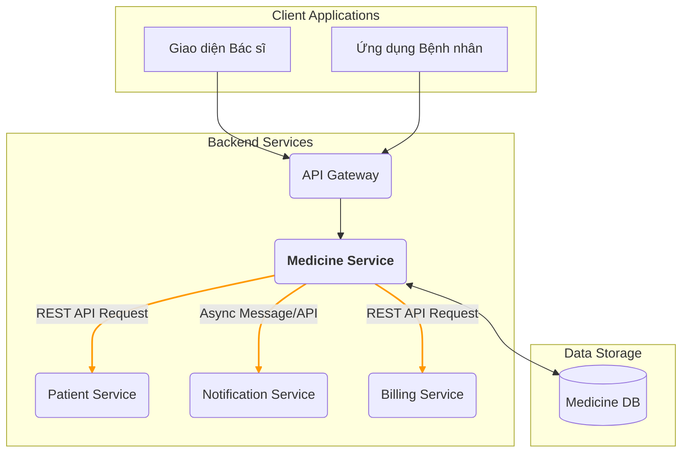
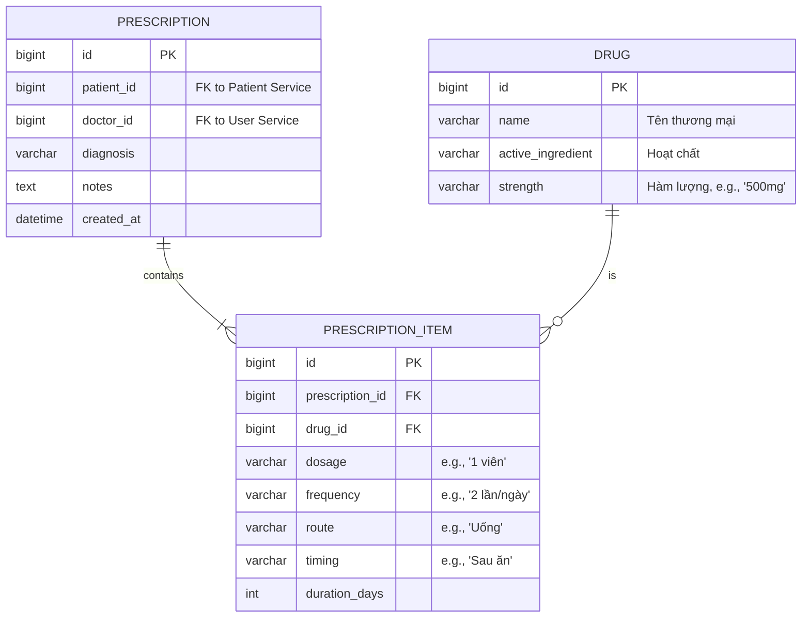

# **Tài liệu Đặc tả Yêu cầu: Service Quản lý Thuốc**

**Version:** 1.0
**Ngày cập nhật:** 2025-09-13
**Author:** Vgng

## **1. Giới thiệu**

### **1.1. Mục đích**

Tài liệu này đặc tả các yêu cầu về chức năng và phi chức năng cho **Service Quản lý Thuốc (Medicine Service)**. Service này là một thành phần cốt lõi trong hệ thống Chăm sóc Sức khỏe cho Bệnh nhân Tim mạch, có nhiệm vụ số hóa và tối ưu hóa quy trình kê đơn thuốc, nâng cao độ an toàn cho bệnh nhân thông qua các cơ chế kiểm tra tự động, và cung cấp dữ liệu cho các phân hệ khác.

### **1.2. Bối cảnh Hệ thống**

Medicine Service là một microservice hoạt động trong một hệ sinh thái phần mềm y tế lớn hơn. Service này không có giao diện người dùng trực tiếp mà cung cấp các API để tương tác với các thành phần khác, bao gồm:

*   **Giao diện Bác sĩ (Doctor's Portal/UI):** Nơi bác sĩ thực hiện các thao tác nghiệp vụ.
*   **Patient Service:** Nguồn cung cấp thông tin định danh và lịch sử y tế của bệnh nhân.
*   **Notification Service:** Chịu trách nhiệm gửi các loại thông báo (Email, SMS, Push Notification) đến bệnh nhân.
*   **Ứng dụng Bệnh nhân (Patient App):** Cung cấp các tiện ích cho bệnh nhân như xem lại đơn thuốc, lịch uống thuốc.
*   **Billing Service:** Xử lý các nghiệp vụ liên quan đến thanh toán viện phí.

### **1.3. Phạm vi**

#### **Chức năng trong phạm vi (In-Scope):**

*   Nghiệp vụ tạo, truy vấn và quản lý đơn thuốc điện tử.
*   Tích hợp module Hỗ trợ Quyết định Lâm sàng (CDSS) để kiểm tra tương tác thuốc, liều lượng và dị ứng.
*   Tạo lập lịch trình uống thuốc chi tiết và khởi tạo yêu cầu gửi thông báo đến Notification Service.
*   Kết xuất (export) đơn thuốc ra định dạng PDF theo mẫu chuẩn.
*   Cung cấp các API để các service khác truy xuất dữ liệu liên quan đến thuốc và đơn thuốc.
*   Tổng hợp dữ liệu và cung cấp các báo cáo thống kê trực quan.

#### **Chức năng ngoài phạm vi (Out-of-Scope):**

*   Quản lý quy trình đăng ký khám bệnh và chẩn đoán lâm sàng (Appointment Service, Patient Service).
*   Tích hợp trực tiếp với hệ thống quản lý của các nhà thuốc bên ngoài (Optional).
*   Quản lý tồn kho thuốc (Optional).
*   Xử lý quy trình thanh toán chi phí khám chữa bệnh (Billing Service).

### **1.4. Đối tượng sử dụng (Actors)**

*   **Bác sĩ (Doctor):** Người dùng chính, trực tiếp tạo và quản lý đơn thuốc thông qua giao diện người dùng (UI).
*   **Quản trị viên Hệ thống (Administrator):** Truy cập vào các báo cáo, thống kê để theo dõi và đánh giá.
*   **Hệ thống/Service khác (System):** Các service khác trong hệ sinh thái (Patient Service, Appointment Service, Notification Service, Billing Serrvice) gọi đến API của Medicine Service để thực thi các nghiệp vụ liên quan.

## **2. Kiến trúc và Tích hợp**

### **2.1. Sơ đồ Kiến trúc Tổng quan**

### **2.2. Các Service phụ thuộc**

*   **Patient Service:** Medicine Service yêu cầu truy cập thông tin bệnh nhân (ID, tuổi, cân nặng, tiền sử dị ứng) để phục vụ cho CDSS và tạo đơn thuốc.
*   **Notification Service:** Medicine Service gửi yêu cầu kèm theo lịch trình uống thuốc để service này thực hiện việc nhắc nhở bệnh nhân.

## **3. Yêu cầu Chức năng (Functional Requirements)**

### **UC-01: Bác sĩ Quản lý Đơn thuốc Điện tử**

*   **Mô tả:** Bác sĩ tạo, xem xét và hoàn tất đơn thuốc cho bệnh nhân sau quá trình chẩn đoán.
*   **Actor:** Bác sĩ.
*   **Luồng sự kiện chính:**
    1.  Bác sĩ chọn bệnh nhân trên giao diện và chọn chức năng "Tạo đơn thuốc mới".
    2.  Giao diện gửi yêu cầu đến Medicine Service. Service lấy thông tin cần thiết của bệnh nhân từ Patient Service (như tiền sử dị ứng).
    3.  Bác sĩ tìm kiếm và thêm từng loại thuốc vào đơn. Với mỗi loại thuốc, bác sĩ nhập các thông tin: hàm lượng, liều dùng, tần suất, đường dùng, thời điểm dùng, thời gian dùng và các ghi chú đặc biệt.
    4.  **(Kích hoạt UC-02)** Với mỗi lần thêm/thay đổi thuốc, hệ thống ngầm thực thi các kiểm tra của CDSS và hiển thị cảnh báo ngay lập tức nếu có.
    5.  Sau khi thêm đủ các thuốc, bác sĩ chọn "Lưu và Hoàn tất".
    6.  Medicine Service lưu trữ đơn thuốc vào cơ sở dữ liệu, tạo một mã định danh duy nhất (prescription\_id) và trả về cho giao diện.
    7.  **(Kích hoạt UC-03)** Đồng thời, service tạo lịch trình uống thuốc và gửi yêu cầu đến Notification Service.
    8.  Bác sĩ có thể chọn chức năng "In đơn thuốc". Hệ thống sẽ tạo một file PDF từ đơn thuốc đã lưu và cho phép tải về.

### **UC-02: Hệ thống Hỗ trợ Quyết định Lâm sàng (CDSS)**

*   **Mô tả:** Một module tự động chạy nền để cung cấp các cảnh báo an toàn dược cho bác sĩ ngay tại thời điểm kê đơn.
*   **Actor:** Hệ thống.
*   **Các quy tắc nghiệp vụ:**
    *   **Cảnh báo Tương tác thuốc:**
        *   **Trigger:** Khi một thuốc mới được thêm vào đơn đã có sẵn thuốc khác.
        *   **Process:** Hệ thống đối chiếu cặp hoạt chất của các thuốc trong đơn với cơ sở dữ liệu về tương tác thuốc (drug interaction database).
        *   **Output:** Hiển thị cảnh báo với mức độ (Nặng, Trung bình, Nhẹ) và mô tả về tương tác nếu có.
    *   **Kiểm tra Liều lượng:**
        *   **Trigger:** Khi bác sĩ nhập liều lượng cho một loại thuốc.
        *   **Process:** Dựa trên tuổi, cân nặng của bệnh nhân (lấy từ Patient Service), hệ thống so sánh liều lượng/ngày với liều khuyến cáo tối đa của thuốc đó.
        *   **Output:** Hiển thị cảnh báo "Liều vượt ngưỡng" hoặc "Liều cho trẻ em/người cao tuổi cần xem xét".
    *   **Cảnh báo Dị ứng:**
        *   **Trigger:** Khi một thuốc mới được thêm vào đơn.
        *   **Process:** Hệ thống kiểm tra hoạt chất của thuốc với danh sách dị ứng đã ghi nhận trong hồ sơ bệnh nhân (lấy từ Patient Service).
        *   **Output:** Hiển thị cảnh báo nổi bật "Bệnh nhân có tiền sử dị ứng với [tên hoạt chất]".

### **UC-03: Cung cấp Dữ liệu và Lịch trình cho Bệnh nhân**

*   **Mô tả:** Service cung cấp dữ liệu cho các ứng dụng phía bệnh nhân và khởi tạo quy trình nhắc nhở.
*   **Actor:** Hệ thống (Patient App, Notification Service).
*   **Luồng sự kiện:**
    1.  Khi một đơn thuốc được lưu thành công (từ UC-01).
    2.  Medicine Service xử lý thông tin đơn thuốc để tạo ra một cấu trúc dữ liệu về lịch trình uống thuốc (ví dụ: `[{drug_name, time, dosage, note}]`).
    3.  Service gửi một request (API call hoặc message queue) đến Notification Service, chứa `patient_id` và lịch trình này.
    4.  Đồng thời, service cung cấp các API endpoint để Patient App có thể gọi đến và hiển thị lịch sử đơn thuốc, chi tiết từng đơn và thông tin tra cứu về thuốc.

### **UC-04: Báo cáo và Thống kê**

*   **Mô tả:** Cung cấp dashboard với các biểu đồ trực quan cho phép quản trị viên theo dõi hoạt động kê đơn.
*   **Actor:** Quản trị viên.
*   **Các chỉ số yêu cầu:**
    *   Biểu đồ cột: Top 10 loại thuốc được kê đơn nhiều nhất (theo tháng/quý/năm).
    *   Biểu đồ tròn: Tỷ lệ kê đơn theo từng nhóm bệnh tim mạch chính (ví dụ: Tăng huyết áp, Bệnh mạch vành, Suy tim...).
    *   Biểu đồ đường: Xu hướng số lượng đơn thuốc được tạo theo thời gian.

## **4. Yêu cầu Phi Chức năng (Non-Functional Requirements)**

*   **Hiệu năng (Performance):**
    *   Thời gian phản hồi của các API đọc dữ liệu (GET) phải dưới 200ms.
    *   Thời gian phản hồi của API tạo đơn thuốc (bao gồm cả kiểm tra CDSS) phải dưới 500ms.
*   **Bảo mật (Security):**
    *   Mọi API endpoint phải được bảo vệ, yêu cầu xác thực và phân quyền (ví dụ: sử dụng JWT).
    *   Dữ liệu nhạy cảm của bệnh nhân phải được mã hóa khi lưu trữ (encryption at rest) và trên đường truyền (encryption in transit - HTTPS/TLS).
*   **Tính sẵn sàng (Availability):**
    *   Hệ thống phải đảm bảo độ sẵn sàng 99.9% (uptime).
*   **Khả năng mở rộng (Scalability):**
    *   Kiến trúc service phải cho phép mở rộng theo chiều ngang (horizontal scaling) để đáp ứng khi số lượng người dùng và yêu cầu tăng lên.

## **5. API Endpoints Sơ bộ (Preliminary API Endpoints)**

| Method | Endpoint                             | Mô tả                                                |
| :----- | :----------------------------------- | :--------------------------------------------------- |
| `POST` | `/api/v1/prescriptions`              | Tạo một đơn thuốc mới.                               |
| `GET`  | `/api/v1/prescriptions/{id}`         | Lấy chi tiết một đơn thuốc theo ID.                  |
| `GET`  | `/api/v1/patients/{patientId}/prescriptions` | Lấy danh sách tất cả đơn thuốc của một bệnh nhân. |
| `GET`  | `/api/v1/prescriptions/{id}/pdf`     | Tải về file PDF của đơn thuốc.                      |
| `GET`  | `/api/v1/drugs?search={query}`       | Tìm kiếm thuốc trong cơ sở dữ liệu.                  |
| `GET`  | `/api/v1/statistics/top-drugs`       | Lấy dữ liệu thống kê về các thuốc được dùng nhiều.   |

## **6. Mô hình Dữ liệu (Data Model)**

### **6.1. Sơ đồ Quan hệ Thực thể (ERD)**

### **6.2. Mô tả Bảng**

*   **PRESCRIPTION:** Lưu trữ thông tin chung của một lần kê đơn. `patient_id` và `doctor_id` là các khóa ngoại tham chiếu đến các service khác.
*   **PRESCRIPTION\_ITEM:** Lưu trữ chi tiết từng loại thuốc trong một đơn thuốc.
*   **DRUG:** Bảng danh mục chứa thông tin về các loại thuốc có trong hệ thống.