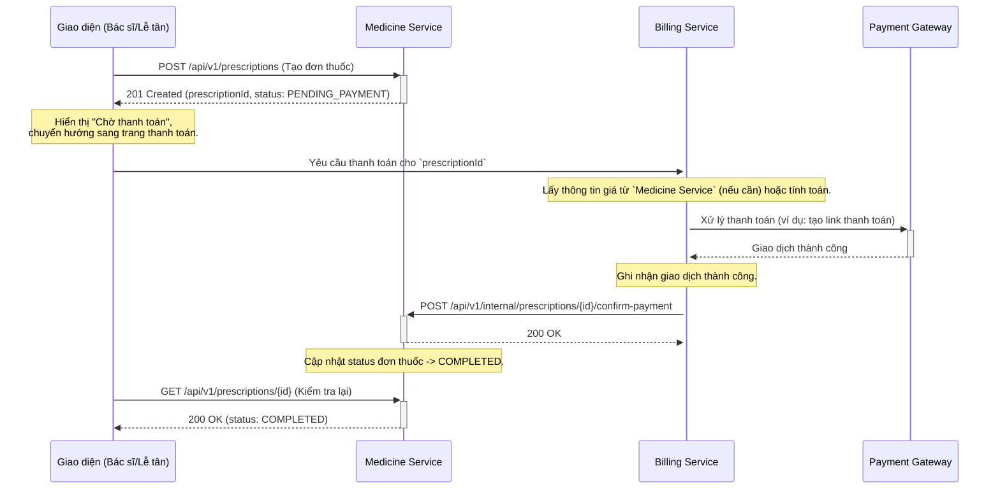
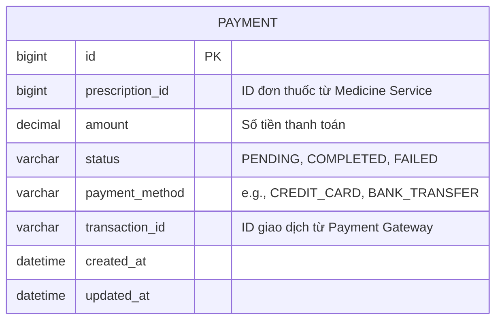

# Thiết kế Billing Service và Tích hợp với Medicine Service

## 1. Tổng quan

`Billing Service` là một microservice độc lập, chịu trách nhiệm xử lý tất cả các nghiệp vụ liên quan đến thanh toán cho đơn thuốc được tạo ra từ `Medicine Service`.

Thiết kế này tuân thủ theo mô hình **Choreography-based Saga**, giảm sự phụ thuộc trực tiếp và tăng tính tự chủ của mỗi service. `Medicine Service` không cần biết về logic thanh toán, và `Billing Service` không cần biết về logic tạo đơn thuốc.

## 2. Luồng nghiệp vụ (Workflow)

Luồng thanh toán cho một đơn thuốc diễn ra như sau:



**Diễn giải luồng:**

1.  **Tạo đơn thuốc:** Giao diện người dùng (UI) gửi yêu cầu tạo đơn thuốc đến `Medicine Service`. Service này tạo đơn thuốc với trạng thái `PENDING_PAYMENT` và trả về `prescriptionId`.
2.  **Bắt đầu thanh toán:** UI nhận `prescriptionId` và điều hướng người dùng đến một trang/module thanh toán, gọi đến `Billing Service` với `prescriptionId` này.
3.  **Xử lý thanh toán:** `Billing Service` chịu trách nhiệm tương tác với Cổng thanh toán (Payment Gateway) để xử lý giao dịch.
4.  **Xác nhận thanh toán:** Sau khi thanh toán thành công, `Billing Service` gọi đến endpoint nội bộ của `Medicine Service` để xác nhận.
5.  **Hoàn tất:** `Medicine Service` cập nhật trạng thái đơn thuốc thành `COMPLETED`. Từ lúc này, các chức năng như "In đơn thuốc" sẽ được kích hoạt.

## 3. Thiết kế API Tích hợp

`Billing Service` sẽ gọi đến `Medicine Service` thông qua endpoint nội bộ mà chúng ta đã xây dựng.

-   **Endpoint:** `POST /api/v1/internal/prescriptions/{id}/confirm-payment`
-   **Method:** `POST`
-   **Path Variable:** `id` - ID của đơn thuốc cần xác nhận.
-   **Request Body:** Trống.
-   **Response:**
    -   `200 OK`: Nếu cập nhật thành công.
    -   `404 Not Found`: Nếu không tìm thấy đơn thuốc với `id` tương ứng.
    -   `401 Unauthorized` / `403 Forbidden`: Nếu xác thực không thành công.

### 3.1. Bảo mật API nội bộ

Đây là endpoint cực kỳ quan trọng và không được phép truy cập từ bên ngoài. Chúng ta sẽ sử dụng cơ chế **API Key (Shared Secret)** để bảo mật.

-   **Cơ chế:**
    1.  Một chuỗi bí mật (secret key) được tạo ra và chia sẻ an toàn giữa `Medicine Service` và `Billing Service`. Key này được lưu trong biến môi trường (environment variable) của cả hai service.
    2.  Khi `Billing Service` gọi đến endpoint, nó sẽ đính kèm secret key này vào HTTP Header, ví dụ: `X-Internal-Secret: <your-secret-key>`.
    3.  `Medicine Service` sẽ có một bộ lọc (filter) chặn tất cả các request đến `/api/v1/internal/**`. Filter này sẽ kiểm tra sự tồn tại và tính hợp lệ của header `X-Internal-Secret`.
    4.  Nếu key hợp lệ, request được đi tiếp. Nếu không, trả về lỗi `401 Unauthorized`.

-   **Ví dụ cách implement trong `SecurityConfig` của `Medicine Service`:**
    ```java
    // Sẽ được implement chi tiết trong Kế hoạch Ngày 7
    http.authorizeHttpRequests(auth -> auth
        .requestMatchers("/api/v1/internal/**").hasRole("INTERNAL_SERVICE") // Role ảo được gán bởi filter
        // ... các rule khác
    );
    // Thêm một custom filter trước filter xác thực chính
    http.addFilterBefore(new InternalApiAuthenticationFilter(), UsernamePasswordAuthenticationFilter.class);
    ```

## 4. Mô hình dữ liệu (Gợi ý cho Billing Service)

`Billing Service` cần có bảng dữ liệu riêng để quản lý các giao dịch.



Bảng `PAYMENT` này giúp `Billing Service` hoạt động độc lập, có thể thực hiện truy vấn, báo cáo, hoặc đối soát giao dịch mà không cần gọi sang `Medicine Service`.